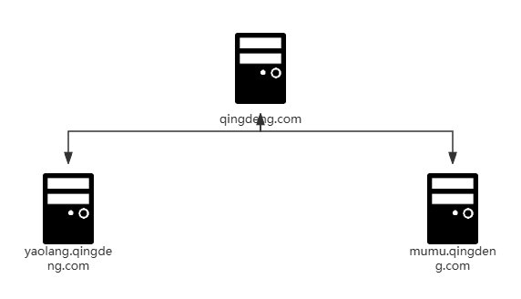

# 内网基础
## 内网工作环境
内网也指**局域网**，是指某一区域由多台计算机互连而成的计算机组。

### 工作组
对局域网中的计算机进行分类，将计算机分为若干个组，每组称为一个工作组。工作组中每个计算机都是**对等的**，可以**随意加入和退出**，且**不同工作组之间的共享资源可以相互访问**。

### 域
**概念** 域是一个**有安全边界的计算机集合**(安全边界：在两个域中，一个域的用户无法访问另一个域中的资源)，和工作组相对应，是由工作组升级而来的高级架构。而相对于工作组而言，有一个更加严格的**安全管理控制机制**，在域环境中，所有用户账户、用户组、计算机、打印机和其他安全主体都在一个或多个域控制器中进行身份验证。如果你想访问域内的资源，就必须拥有一个合法身份登录到该域中。而你对该域内的资源拥有什么样的权限，取决于你在该域中的用户身份。

**域控制器(域控, Domain Controller, DC)** 是域环境中的核心服务器计算机，用于管理所有的网络访问，负责允许或拒绝发出请求的主机访问域内环境，以及对用户进行身份验证、存储用户账户信息并执行域的安全策略等。\
域控制器**包含一个活动目录数据库**，其中存储着整个域的账户、密码、计算机等信息。\
一个域环境可以拥有一台或多台域控制器，每台域控制器各自存储一份所在域的活动目录的可写副本，对活动目录的任何修改都可以从源域控制器同步复制到域、域树或域林的其他控制器上。即使其中的一台域控制器瘫痪，另一台域控制器可以继续工作，以保证环境的正常运行。
### 域的分类
单域：网络环境中只有一个域


父域和子域：出于管理及其他一些需求，需要在网络中划分多个域，第一个域称为父域，各分部的域称为该域的子域。例如，在一个大型组织的各部门位于不同的地理位置，这种情况下就可以把不同位置的部分分别放在不同的子域，然后各部门通过自己的域来管理相对应的资源，并且每个子域都能拥有自己的安全策略。


域树：若干个域通过信任关系组成的集合。一个域管理员只能管理本域的内部，不能访问或者管理其他域，两个域之间相互访问则需要建立信任关系 (Trust Relation)。信任关系是连接在域与域之间的桥梁。父域与子域之间自动建立起了双向信任关系，域树内的父域与子域之间不但可以按需进行相互管理，还可以跨网分配文件和打印机等设备资源，使不同的域之间实现网络资源的共享与管理，以及相互通信和数据传输。


域森林：由**一个或多个没有形成连续名称空间的域树**通过建立信任关系组成的集合。可以通过域树之间建立的信任关系来管理和使用整个森林中的资源，从而又保持了原有域自身原有的特性。


DNS域名服务器：进行域名(domain name)和与之相对应的IP地址 (IPaddress)转换的服务器。
> - 在域树的介绍中，可以看到域树中的域的名字和DNS域的名字非常相似，实际上**域的名字就是DNS域的名字**，因为域中的计算机使用DNS来定位域控制器和服务器以及其他计算机、网络服务等。
> - 一般情况下,我们在内网渗透时就**通过寻找DNS服务器来定位域控制器，因为通常DNS服务器和域控制器会处在同一台机器上**。

## 活动目录(Active Directory, AD)
域环境中提供目录服务的组件，用于存储有关网络对象(用户、组、计算机、共享资源、联系人、组织单位、安全策略等)的信息。目录数据存储在域控制器的`ntds.dit`文件中，该文件是活动目录数据库，是活动目录的核心。活动目录主要提供以下功能：
> - 计算机集中管理：集中管理所有加入域的服务器及客户端计算机，统一下发组策略。
> - 用户集中管理：集中管理域用户、组织通讯录、用户组，对用户进行统一的身份认证、资源授权等。
> - 资源集中管理：集中管理域中的打印机、文件共享服务等网络资源。
> - 环境集中管理：集中的配置域中计算机的工作环境，如统一计算机桌面、统一网络连接配置，统一计算机安全配置等。 
> - 应用集中管理：对域中的计算机统一推送软件、安全补丁、防病毒系统，安装网络打印机等。

AD与DC的区别：
> - 如果网络规模较大，我们就考虑把网络中的众多对象(计算机、用户、用户组、打印机、共享文件等)分门别类、井然有序地放在一个大仓库中，并做好检索信息，以利于查找、管理和使用这些对象（资源）。这个**有层次结构的数据库，就是活动目录数据库，简称AD库**。
> - 把存放有活动目录数据库的计算机称为DC，要实现域环境，就需要安装AD。当内网中的**一台计算机安装了AD后，就变为了DC**。

### ntds.dit文件
该文件的默认路径为域控的`%SystemRoot\NTDS\ntds.dit`，包括但不限于有关域用户、用户密码的哈希散列值、用户组、组成员身份和组策略的信息。`ntds.dit`文件使用存储在系统SYSTEM文件的密钥对这些哈希值进行解密。

而在非域环境也就是在工作组环境中，用户的密码等信息存储在SAM文件，想要破解SAM文件与`ntds.dit`文件都需要拥有一个System文件。和SAM文件一样，`ntds.dit`是默认被Windows系统锁定的。

### 目录服务与LDAP
> 关于LDAP：[LDAP学习笔记总结](https://www.cnblogs.com/kevingrace/p/5773974.html)

目录是为了浏览和搜索数据而设计的**特殊数据库(目录数据库)**，目录数据库将所有数据组织成一个有层次的树状结构，其中的每个节点是一个对象，有关这个对象的所有信息作为这个对象的属性被存储，用户可以根据对象名称去查找这个对象的有关信息。

LDAP(lightweight directory access protocol,轻量级目录访问协议)是用来访问目录数据库的协议，运行在TCP/IP或其他面向连接的的传输协议之上。

基本概念：
1. 目录树：在一个目录服务系统中，整个目录信息集可以表示为一个目录信息树，树中的每个节点是一个条目。
2. 条目：每个条目就是一条记录，每个条目有自己的唯一可区别的名称（DN）。
3. DN（Distinguished Name，绝对可辨识名称）：指向一个LDAP对象的完整路径。DN由对象本体开始，向上延伸到域顶级的DNS命名空间。
4. RDN（Relative Distinguished Name，相对可辨识名称）：用于指向一个LDAP对象的相对路径。
5. 对象类：与某个实体类型对应的一组属性，对象类是可以继承的，这样父类的必须属性也会被继承下来。
6. 属性：描述条目的某个方面的信息，一个属性由一个属性类型和一个或多个属性值组成，属性有必须属性和非必须属性。


例如，CN=DC1, OU=Domain Controllers, DC=mumu, DC=com的含义是DC1对象在mumu.com域的Domain Controllers组织单元中。

下图对应的条目信息为(简而言之，必须包含objectclass来声明一个条目有哪几大类属性(即属性类),然后再按照声明的属性类来设置属性值)：
```ldif
dn: dc=mydomain, dc=org
objectclass: top
objectclass: dcobject
objectclass: organization
dc: mydomain
o: mydomain, Inc.

dn: ou=admin, dc=mydomain, dc=org
objectclass: organizationalUnit
ou: admin

dn: ou=people, dc=mydomain, dc=org
objectclass: organizationalUnit
ou: people

dn: ou=device, dc=mydomain, dc=org
objectclass: organizationalUnit
ou: device

dn: cn=admin, ou=admin, dc=mydomain, dc=org
objectclass: person
objectclass: organizationalPerson
objectclass: inetOrgPerson
cn: admin
sn: admin
uid: admin

dn: ou=marketing, ou=people, dc=mydomain, dc=org
objectclass: organizationalUnit
ou: marketing

dn: ou=network, ou=people, dc=mydomain, dc=org
objectclass: organizationalUnit
ou: network

dn: cn=scott, ou=marketing, ou=people, dc=mydomain, dc=org
objectclass: person
objectclass: organizationalPerson
objectclass: inetOrgPerson
cn: scott
sn: scott
ou: marketing
uid: scott
description: great

dn: cn=baby, ou=marketing, ou=people, dc=mydomain, dc=org
objectclass: person
objectclass: organizationalPerson
objectclass: inetOrgPerson
cn: baby
sn: baby
ou: marketing
uid: baby
description: cute
```


### 活动目录分区
活动目录可以支持数以千万计的对象。为了扩大这些对象，微软将活动目录数据库划分为多个分区，以方便进行复制和管理。每个逻辑分区在域林中的域控制器之间分别复制、更改。这些分区被称为上下文命名（Naming Context，NC）。

活动目录预定义了域分区、配置分区和架构分区:
* 域分区（Domain NC）：用于存储与该域有关的对象信息，这些信息是特定于该域的，如该域中的计算机、用户、组、组织单位等信息。在**域森林中，每个域的域控各自拥有一份属于自己的域分区，只会被复制到本域的所有域控制器中**。
* 配置分区（Configuration NC）：存储整个域森林的主要配置信息，包括有关站点、服务、分区和整个活动目录结构的信息。**整个域森林共享一份相同的配置分区，会被复制到域森林中所有域的控制器上**。
* 架构分区（Schema NC）：存储整个域森林的架构信息，包括活动目录中的所有类，对象和属性的定义数据。**整个域森林共享一份相同的架构分区，会被复制到域森林中所有域的控制器中**。

### 活动目录查询
#### #ldap基于属性的过滤
LDAP 搜索过滤器语法有以下逻辑运算符:

<style>
.center 
{
  width: auto;
  display: table;
  margin-left: auto;
  margin-right: auto;
}
</style>
<style>
.left 
{
  width: auto;
  display: table;
  margin-left: auto;
  margin-right: auto;
}
</style>
<p align="center"><font face="黑体" size=2.></font></p>
<div class="center">

| 运算符 | 说明           |
|:---:|:------------:|
| &   | AND 运算符      |
| |   | OR 运算符       |
| !   | NOT 运算符      |
| =   | 用与名称和值做相等比较  |
| *   | 通配符          |
</div>

下面是一些例子：

<p align="center"><font face="黑体" size=1.></font></p>
<div class="left">
<pre>
    (uid=testuser)：匹配 uid 属性为 testuser 的所有对象
    (uid=test*)：匹配 uid 属性以 test 开头的所有对象
    (!(uid=test*))：匹配 uid 属性不以 test 开头的所有对象
    (&(department=1234)(city=Paris))：匹配 department 属性为1234且city属性为Paris的所有对象
    (|(department=1234)(department=56*))：匹配 department 属性的值刚好为1234或者以56开头的所有对象。
</pre>
</div>

#### #ldap按位查询
在 LDAP 里面，有些属性字段是位字段，这里以 userAccountControl 举例，其记录了用户的 AD 账号的很多属性信息，该字段就是一个的位字段。之所以说 userAccountControl 是一个位字段，是因为它是由一个个位构成：

<div class="center">

| Property flag              | Value in hexadecimal | Value in decimal |
|:--------------------------:|:--------------------:|:----------------:|
| SCRIPT                     | 0x0001               | 1                |
| ACCOUNTDISABLE             | 0x0002               | 2                |
| HOMEDIR_REQUIRED           | 0x0008               | 8                |
| LOCKOUT                    | 0x0010               | 16               |
| PASSWD_NOTREQD             | 0x0020               | 32               |
| PASSWD_CANT_CHANGE         | 0x0040               | 64               |
| ENCRYPTED_TEXT_PWD_ALLOWED | 0x0080               | 128              |
| TEMP_DUPLICATE_ACCOUNT     | 0x0100               | 256              |
| NORMAL_ACCOUNT             | 0x0200               | 512              |
| INTERDOMAIN_TRUST_ACCOUNT  | 0x0800               | 2048             |
| WORKSTATION_TRUST_ACCOUNT  | 0x1000               | 4096             |
| SERVER_TRUST_ACCOUNT       | 0x2000               | 8192             |
| DONT_EXPIRE_PASSWORD       | 0x10000              | 65536            |
| MNS_LOGON_ACCOUNT          | 0x20000              | 131072           |
| SMARTCARD_REQUIRED         | 0x40000              | 262144           |
| TRUSTED_FOR_DELEGATION     | 0x80000              | 524288           |
| NOT_DELEGATED              | 0x100000             | 1048576          |
| USE_DES_KEY_ONLY           | 0x200000             | 2097152          |
| DONT_REQ_PREAUTH           | 0x400000             | 4194304          |
</div>

 比如一个账户，他的 userAccountControl 属性只有 LOCKOUT 和 NOT_DELEGATED 这两个位有值，其他的位都没有，那这个用户的 userAccountControl 属性的值就为 0x100000+0x0010，是个32 位 INT 类型。

 现在，如果我要搜索域内所有设置了 NOT_DELEGATED 位的所有对象，那么像之前那样简单的 LDAP 搜索语法肯定是不行了。因为简单的 LDAP 搜索语法只能对某个属性进行过滤，还不能对属性里面的某个具体的位进行过滤，这就引出了 LDAP 的按位搜索。

 LDAP 的按位搜索的语法如下：
 ```
 <属性名称>:<BitFilterRule-ID>:=<十进制比较值>
 ```
  其中的<BitFilterRule-ID>指的是位过滤规则所对应的 ID，大致内容如下：

| **位过滤规则**                          | **OID**                  |
|:----------------------------------:|:------------------------:|
| LDAP_MATCHING_RULE_BIT_AND         | 1.2.840.113556.1.4.803   |
| LDAP_MATCHING_RULE_OR              | 1.2.840.113556.1.4.804   |
| LDAP_MATCHING_RULE_TRANSITIVE_EVAL | 1.2.840.113556.1.4.1941  |
| LDAP_MATCHING_RULE_DN_WITH_DATA    | 1.2.840.113556.1.4.2253  |

 比如我们查询域内所有设置了 NOT_DELEGATED 位的所有对象，NOT_DELEGATED 对应的十进制比较值位 1048576，那么根据语法，我们便可以构造以下过滤语法：
```
(userAccountControl:1.2.840.113556.1.4.803:=1048576)
```

#### #Adfind查询活动目录
Adfind的使用结构如下：
```
AdFind [switches] [-b basedn] [-f filter] [attr list]

# switches: 连接参数。如果Adfind在域内机器上运行，则不需要添加该选项；
如果在域外机器上执行，则需要指定域控并提供一个有效的域用户和密码。
    -h：指定主机和端口（ip:port）
    -p：可单独使用-p来指定端口
    -u: 指定用户
    -up: 指定密码
# -b basedn: 指定查询的根节点
# -f filter: 指定查询的过滤条件
# attr list: 指定查询出来的结果显示哪个属性。当不使用该参数时，会显示查询对象的所有属性。

例如，查询域mumuyali.cn中的所有person对象，并显示cn和sn属性：
Adfind.exe -b "dc=mumuyali, dc=cn" -f "objectclass=person" cn sn
```
AdFind常用查询命令：
- 查询shentou.com域中所有computer对象并显示所有属性：Adfind.exe -b "dc=shentou, dc=com" -f "objectClass=computer"
- 查询shentou.com域中所有computer对象并过滤对象的name和operatingSystem属性：Adfind.exe -b "dc=shentou, dc=com" -f "objectClass=computer" name operatingSystem
- 查询指定主机的相关信息：Adfind.exe -sc c:<Name/SamAccountName>
- 查询当前域中主机的数量：Adfind.exe -sc adobjcnt:computer
- 查询当前域中被禁用的主机：Adfind.exe -sc computers_disabled
- 查询当前域中不需要密码的主机：Adfind.exe -sc computers_pwdnotreqd
- 查询当前域中在线的计算机：Adfind.exe -sc computers_active
- 查询shentou.com域中所有user对象并过滤对象的cn属性：Adfind.exe -b "dc=shentou, dc=com" -f "objectClass=user" cn
- 查询当前登录的用户用户信息和Token：Adfind.exe -sc whoami
- 查询指定用户的相关信息：Adfind.exe -sc u:<Name/SamAccountName>
- 查询当前域中所有用户：AdFind.exe -users name
- 查询当前域中用户的数量：Adfind.exe -sc adobjcnt:user
- 查询当前域中被禁用用户：Adfind.exe -sc users_disbaled
- 查询当前域中密码永不过期的用户：Adfind.exe -sc users_noexpire
- 查询当前域中不需要密码的用户：Adfind.exe -sc users_pwdnotreqd
- 查询当前域中所有域控制器：Adfind.exe -sc dclist
- 查询当前域中所有只读域控制器：Adfind.exe -sc dclist:rodc
- 查询当前域中所有可读写域控制器：Adfind.exe -sc dclist:!rodc
- 查询所有的组策略对象并显示所有属性：Adfind.exe -sc gpodmp
- 查询域信任关系：Adfind.exe -f "objectClass=trusteddomain"
- 查询shentou.com域中具有高权限的SPN：Adfind.exe -b "dc=shentou, dc=com" -f "&(servicePrincipalName=*)(admincount=1)" servicePrincipalName
- 查询当前域中域管账户：AdFind.exe -default -f "(&(|(&(objectCategory=person)(objectClass=user))(objectCategory=group))(adminCount=1))" -dn
- 查询当前域中配置非约束委派的用户：AdFind.exe -b "DC=tubai,DC=com" -f "(&(samAccountType=805306368)(userAccountControl:1.2.840.113556.1.4.803:=524288))" cn distinguishedName
- 查询当前域中配置非约束委派的主机：AdFind.exe -b "DC=tubai,DC=com" -f "(&(samAccountType=805306369)(userAccountControl:1.2.840.113556.1.4.803:=524288))"

## 域用户与机器用户
### 域用户
域环境中的用户。在DC中创建，并保存在活动目录中。域用户账户是在域内全局组 Domain Users 组中，本地用户账户在本地 User 组中。当计算机加入域时，会把 Domain Users 组添加到本地的 User 组中。因此域用户可以在域中的任何一台计算机上登录。

### 机器用户
机器用户其实是一种特殊的域用户(**computer是user的子类，继承user类的属性。而域用户是user类的实例。域用户该有的属性，机器用户都有，可以说，机器用户就是一种域用户**)。在域环境中，计算机上的本地用户SYSTEM对应域中的机器用户，在域中的用户名就是`机器名+$`。例如，`WIN11-PC1`在域中登录的用户名就是`Win11-PC1$`。

<mark>当获取到一台域中主机的控制权后，当没有发现域用户凭据时，可以利用系统提权的方式，将当前用户提权到SYSTEM充当机器用户，以机器用户权限进行域内的操作(即`SYSTEM<=>机器用户==域用户`)。</mark>

## 域用户组
在域环境中，为了方便对用户权限进行管理，需要将具有相同权限的用户划分为一组，这样只要对这个用户组赋予了一定的权限，那么该组内的用户就获得了相同的权限。
### 分类
组是用户账户的集合，按照用途分为通讯组和安全组。

通讯组就是一个通讯群组。例如，将某个部门所有员工拉进同一个通讯组，当给这个通讯组发送消息时，组内所有成员都可以收到。**只是用在电子邮件通信，无法做权限控制**。

安全组则是用户权限的集合。例如，管理员在日常的网络管理中，不必向每个用户账号都设置单独的访问权限，只需要创建一个组，对该组赋予权限，再将需要该权限的用户拉进改组即可。

### 权限
根据组的**作用范围**，安全组可以分为域本地组、通用组和全局组。
#### #域本地组(Domain Local Group, 多域用户访问单域资源(访问同一个域))
主要是用于授予位于本域资源的访问权限，可以从域林的任何域中添加用户账户、通用组和全局组，但无法包含其他域中的域本地组。域本地组不能嵌套于其他组中。**域本地组只能访问本域中的资源，无法访问其他域中的资源**。

常见的系统内置的域本地组及其权限：

- Administrators：管理员组，该组的成员可以不受限制地访问域中资源。
- Print Operators：打印机操作员组，该组的成员可以管理网络中的打印机，还可以在本地登录和关闭域控制器。
- Backup Operators：备份操作员组，该组的成员可以在域控制器中执行备份和还原操作，还可以在本地登录和关闭域控制器。
- Remote Desktop Users：远程登录组，只有该组的成员才有远程登录服务的权限。
- Account Operators：账号操作员组，该组的成员可以创建和管理域中用户和组，为其设置权限，也可以在本地登录域控制器。
- Server Operators：服务器操作员组，该组的成员可以管理域服务器。

#### #全局组(Global Group,单域用户访问多域资源(必须是同一个域里面的用户))
只能在创建该全局组的域上进行添加用户和全局组，可以在域林中的任何域中指派权限，全局组可以嵌套在其他组中。可以将某个全局组添加到同一个域上的另一个全局组中，或添加到其他域的通用组和域本地组中(注意这里不能把它加入到不同域的全局组中，全局组只能在创建它的域中添加用户和组)。虽然可以利用全局组授予访问任何域上的资源的权限，但一般不直接用它来进行权限管理。

常见的系统内置全局组及其权限：

- Domain Admins：域管理员组，该组的成员在所有加入域的服务器上拥有完整的管理员权限。
- Domain Users：域用户组，该组的成员是所有的域用户。在默认情况下，任何新建的用户都是该组的成员。
- Domain Computers：域成员主机组，该组的成员是域中所有的域成员主机，任何新建的计算机账户都是该组的成员。
- Domain Controllers：域控制器组，该组的成员包含域中所有的控制器。
- Domain Guests：域访客用户组，该组成员默认为域访客用户。
- Group Policy Creator Owners：新建组策略对象组，该组的成员可以修改域的组策略。

#### #通用组(Universal Group，多域用户访问多域资源)
作用于域林中的所有域。其成员可以包括域林中任何域的用户账户、全局组和其他通用组，但是无法包含域本地组。通用组可以在域林中的任何域中被指派访问权限，可以嵌套于其他域组中，以便于访问所有域中的资源。集成了全局组和本地域组的优处。

常见的系统内置通用组及其权限：

- Enterprise Admins：组织系统管理员组，该组是域林的根域中的一个组。该组的成员在域林的每个域中都是Administrators组的成员，因此对所有的域控制器都有完全的控制权。
- Schema Admins：架构管理员组，该组是域林根域中的一个组。该组的成员可以修改活动目录，如在架构分区中新增类或属性。

简单理解为：
- 域本地组：来自全林用于本域
- 全局组：来自本域用于全林
- 通用组：来自全林用于全林


## 访问控制
> 参考: [Windows Access Control](https://rootclay.gitbook.io/windows-access-control)

访问控制的工作过程：

访问控制是指Windows操作系统使用内置授权和访问控制技术，确定经过身份验证的用户是否具有访问资源的正确权限，以控制主体（Principal）操作（读取、写入、删除、更改）对象（Object）的行为是否具有合法权限。

在Windows中，访问主体通常是指安全主体。安全主体是任何可通过操作系统进行身份认证的实体，如用户账户、计算机账户、在用户或计算机账户的安全上下文中运行的线程或进程，以及这些账户的安全组等。被访问的对象通常指安全对象，可能是文件、文件夹、打印机、注册表项、共享服务、活动目录域服务对象等。**当经过身份验证的安全主体想访问安全对象时，Windows会为安全主体创建一个访问令牌（Access Token），其中包含验证过程返回的SID和本地安全策略分配给用户的用户权限列表。当安全对象被创建时，Windows会为其创建一个安全描述符（Security Descriptor）。<mark>Windows的访问控制正是将安全主体的访问令牌中的信息与安全对象的安全描述符中的访问控制项进行比较做出访问决策的**</mark>。

### Windows访问控制模型
Windows中的访问控制模型（Access Control Model），它是Windows安全性的基础构件。访问控制模型有两个主要的组成部分，访问令牌（Access Token）和安全描述符（Security Descriptor），它们分别是访问者和被访问者拥有的东西。通过访问令牌和安全描述符的内容，Windows可以确定持有令牌的访问者能否访问持有安全描述符的对象。

#### #访问令牌
访问令牌是描述进程或线程的安全上下文的对象。令牌中的信息包括与进程或线程关联的用户帐户的标识和特权信息。当用户登录时，系统通过将用户密码与安全数据库（如域认证中的NTDS或本地认证中的SAM文件）中存储的信息进行比较来验证用户密码。如果密码经过验证，则系统将生成访问令牌。代表该用户执行的每个进程都有此访问令牌的副本。（通常我们在输入密码登陆进入Windows界面时就是一个生成访问令牌的过程）

当线程与安全对象进行交互或尝试执行需要特权的系统任务时，系统使用访问令牌来标识用户。访问令牌包含以下信息：
- 用户帐户的安全标识符（SID）
- 用户所在组的SID
- 标识当前登录会话（logon session）的登录SID
- 用户或用户组拥有的特权列表
- 所有者SID
- 主要组的SID
- 用户创建安全对象而不指定安全描述符时系统使用的默认DACL
- 访问令牌的来源
- 令牌是主要令牌（内核分配的令牌）还是模拟令牌（模拟而来的令牌）
- 受限制SID的可选列表（如UAC存在时会针对某些账户删除某些特权）
- 当前的模拟级别
- 其他数据

Access tokens产生的大致过程为：
1. 使用凭据(用户密码)进行认证
2. 当前登录会话的Session创建
3. Windows此时会返回用户sid和用户组sid
4. LSA(Local Security Authority)创建一个Token
5. 依据该token创建进程、线程(如果CreaetProcess时自己指定了 Token, LSA会用该Token， 否则就继承父进程Token进行运行)

#### #安全描述符
安全描述符是与被访问对象关联的，它含有这个对象所有者的SID，以及一个访问控制列表（ACL，Access Control List），访问控制列表又包括了DACL（Discretionary Access Control List）和SACL（System Access Control List）以及一组控制位，用于限定安全描述符含义。

安全描述符包含与安全对象关联的安全信息（安全对象是可以具有安全描述符的对象。比如文件、管道、进程、注册表等）,如谁拥有对象、谁可以访问对象、以何种方式访问、审查哪些类型的访问信息等。当安全对象被创建时，操作系统会为其创建一个安全描述符。安全描述符由SECURITY_DESCRIPTOR结构及其关联的安全信息组成。安全描述符的结构体如下：
```c++
typedef struct _SECURITY_DESCRIPTOR {
  BYTE                        Revision;
  BYTE                        Sbz1;
  SECURITY_DESCRIPTOR_CONTROL Control;
  PSID                        Owner;
  PSID                        Group;
  PACL                        Sacl;
  PACL                        Dacl;
} SECURITY_DESCRIPTOR, *PISECURITY_DESCRIPTOR;
```

### 访问控制列表
访问控制列表（ACL）时访问控制项（Acess Control Entry，ACE）的列表。访问控制列表中的每个访问控制项指定了一系列访问权限。ACL分为DACL和SACL两种。

#### #DACL
DACL（自主访问控制列表）是安全对象的访问控制策略，其中定义了该安全对象的访问控制策略，用于指定允许或拒绝特定安全主体对该安全对象的访问。DACL是由一条条的访问控制项（ACE）条目构成的，每条ACE定义了哪些用户或组对该用户拥有怎样的访问权限。

#### #SACL
SACL（System Access Control List，系统访问控制列表）是安全主体对安全对象的访问行为的审计策略。SACL也由一条条的ACE条目构成，每条ACE定义了对哪些安全主体的哪些访问行为进行日志记录，如对指定用户的访问成功、失败行为进行审计记录日志。安全主体的访问行为满足这条ACE时就会被记录。

#### #查看与修改访问控制列表

Icacls是一种命令行工具，使用icalcs命令可以查看或修改指定文件上的访问控制列表（ACL），并将存储的DACL应用于指定目录的文件。


icacls可以查询到的各种权限说明如下：

- 简单权限序列：N，无访问权限；F，完全访问权限；M，修改权限；RX，读取和执行权限；R，只读权限；W，只写权限；D，删除权限。
- 在()中以,分隔的特定权限列表：DE，删除；RC，读取控制；WDAC，写入DAC；WO，写入所有者；S，同步；AS，访问系统安全性；MA，允许的最大值；GR，一般性读取；GW，一般性写入；GE，一般性执行；GA，全为一般性；RD，读取数据/列出目录；WD，写入数据/添加文件；AD，附加数据/添加子目录；REA，读取扩展属性；WEA，写入扩展属性；X，执行/遍历；DC，删除子项；RA，读取属性；WA，写入属性。
- 继承权限可以优先于每种格式，但只应用于目录：OI，对象继承；CI，容器继承；IO，仅继承；NP，不传播继承；I，从父容器继承的权限。